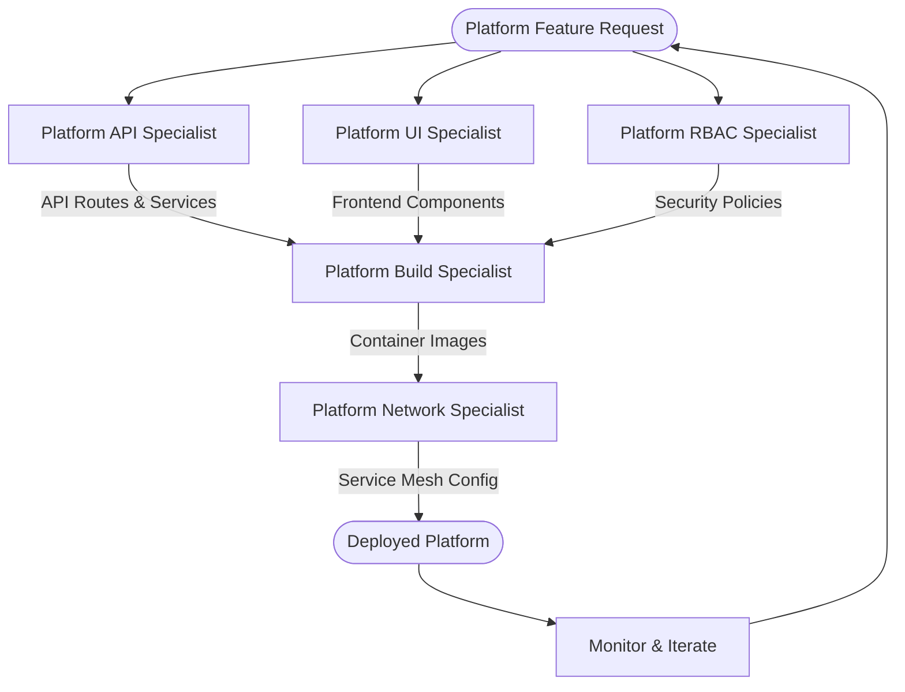

# Platform Engineering Agents - Backstage Integration

This directory contains specialized Claude Code agents for building and operating a modern **Backstage-inspired developer platform** using Azure Service Operator (ASO), Kubernetes, and cloud-native patterns. These agents work together to deliver self-service capabilities, multi-tenant resource management, and enterprise-grade platform engineering.

## Agent Overview

### 🚀 [Platform API Specialist](platform-api-specialist.md)
**Focus**: Backend API development, namespace-as-a-service, RBAC integration
- **Core Responsibilities**: 
  - Node.js/TypeScript backend service development
  - Kubernetes API integration and automation
  - Azure AD authentication and JWT validation
  - Multi-tenant namespace provisioning with quotas
  - Service catalog and template management
  - Analytics and cost tracking APIs
- **Key Technologies**: Express.js, Kubernetes client, Azure SDK, OpenAPI
- **Memory Integration**: Stores API patterns, error handling strategies, authentication flows

### 🎨 [Platform UI Specialist](platform-ui-specialist.md)
**Focus**: Frontend development, user experience, responsive design
- **Core Responsibilities**:
  - React/TypeScript frontend development
  - Material-UI design system implementation
  - Self-service namespace creation forms
  - Service catalog browser with search/filtering
  - Analytics dashboards with interactive charts
  - Multi-tenant UI patterns and team isolation
- **Key Technologies**: React 18+, Material-UI, TypeScript, Chart.js
- **Memory Integration**: Stores UI patterns, component designs, user flow optimizations

### 🔐 [Platform RBAC Specialist](platform-rbac-specialist.md)
**Focus**: Security, access control, Azure AD integration
- **Core Responsibilities**:
  - Role-Based Access Control (RBAC) design and implementation
  - Azure AD Workload Identity configuration
  - Multi-cluster RBAC management
  - Kubernetes namespace-level security policies
  - Automated security policy enforcement
  - RBAC audit and compliance monitoring
- **Key Technologies**: Azure AD, Kubernetes RBAC, ASO security patterns
- **Memory Integration**: Stores RBAC patterns, security policies, compliance frameworks

### 🏗️ [Platform Build Specialist](platform-build-specialist.md)
**Focus**: Containerization, CI/CD, deployment automation
- **Core Responsibilities**:
  - Docker multi-stage build optimization
  - Kubernetes manifest creation and management
  - Container registry operations (Docker Hub, ACR)
  - Environment-specific configurations
  - Build performance optimization and caching
  - Security scanning and vulnerability management
- **Key Technologies**: Docker, Kubernetes, GitHub Actions, Azure Container Registry
- **Memory Integration**: Stores build patterns, optimization techniques, deployment strategies

### 🌐 [Platform Network Specialist](platform-network-specialist.md)
**Focus**: Service mesh, ingress, DNS, TLS certificate management
- **Core Responsibilities**:
  - Istio service mesh configuration (Gateways, VirtualServices)
  - External DNS automation with Azure DNS integration
  - TLS certificate management with cert-manager
  - Service-to-service security (mTLS, authorization policies)
  - Network monitoring and observability
  - DNS and connectivity testing
- **Key Technologies**: Istio, cert-manager, external-dns, Azure DNS
- **Memory Integration**: Stores network patterns, DNS strategies, TLS configurations

## Agent Collaboration Patterns

### 🔄 Full Platform Development Workflow



### 🎯 Example: Complete Namespace-as-a-Service Implementation

**1. RBAC Specialist** - Sets up security foundation
```yaml
# Creates namespace-level RBAC with Azure AD integration
- Team isolation with proper role assignments
- Workload Identity for secure Azure authentication  
- Network policies for multi-tenant security
```

**2. API Specialist** - Implements backend services
```typescript
// Creates REST API for namespace provisioning
POST /api/platform/namespaces
- Validates request parameters
- Applies resource quotas based on tier selection
- Integrates with Kubernetes API
- Returns provisioning status and connection info
```

**3. UI Specialist** - Builds user experience
```tsx
// Creates self-service namespace creation form
<NamespaceProvisionForm>
- Real-time validation and cost estimation
- Team selection with proper permissions
- Resource tier selection with visual quotas
- Progress tracking for async operations
</NamespaceProvisionForm>
```

**4. Build Specialist** - Containerizes and deploys
```dockerfile
# Multi-stage builds for both API and UI
- Optimized container images with security scanning
- Kubernetes manifests with proper resource limits
- Environment-specific configurations
```

**5. Network Specialist** - Configures connectivity
```yaml
# Istio configuration for secure ingress
- Gateway with HTTPS termination
- VirtualService with retry policies
- External DNS automation
- TLS certificates with auto-renewal
```

### 🛠️ Common Integration Scenarios

#### Scenario 1: New Platform Feature Development
```
User Request: "Add cost tracking to the platform dashboard"

1. API Specialist → Implements cost tracking endpoints
2. UI Specialist → Creates cost visualization components  
3. RBAC Specialist → Adds cost:read permissions
4. Build Specialist → Updates containers with new features
5. Network Specialist → Configures monitoring endpoints
```

#### Scenario 2: Security Enhancement
```
User Request: "Implement mTLS between all platform services"

1. RBAC Specialist → Configures service account identities
2. Network Specialist → Implements Istio mTLS policies
3. API Specialist → Updates health checks for mesh
4. Build Specialist → Rebuilds with mesh-aware configurations
5. UI Specialist → Adds security status indicators
```

#### Scenario 3: Multi-Environment Deployment
```
User Request: "Deploy platform to staging and production"

1. Build Specialist → Creates environment-specific images
2. RBAC Specialist → Replicates security policies
3. Network Specialist → Configures DNS and certificates
4. API Specialist → Updates configuration management
5. UI Specialist → Handles environment-specific UI configs
```

## Memory-Driven Collaboration

All agents share a common **Memory-Platform** MCP service that enables:

### 📚 Pattern Sharing
- **API Patterns**: Authentication flows, error handling, async operations
- **UI Components**: Reusable form patterns, chart configurations, responsive layouts  
- **RBAC Templates**: Role definitions, security policies, compliance frameworks
- **Build Optimizations**: Docker layer caching, security scanning, registry strategies
- **Network Configurations**: Service mesh patterns, DNS automation, TLS management

### 🔍 Cross-Agent Learning
```bash
# Agents query shared memory before starting work
mcp memory-platform search_nodes "namespace provisioning ui patterns"
mcp memory-platform open_nodes ["namespace-form-design", "rbac-integration"]

# Agents store successful implementations
mcp memory-platform create_entities [{
  "name": "namespace-creation-flow",
  "entityType": "integration-pattern", 
  "observations": [
    "API validates request and returns provisioning job ID",
    "UI polls status endpoint for real-time updates",
    "RBAC automatically assigns team permissions",
    "Network creates DNS records via external-dns"
  ]
}]
```

## Best Practices for Agent Coordination

### 🎯 Task Handoffs
1. **Clear Boundaries**: Each agent owns specific technology domains
2. **Shared Standards**: Common patterns for configuration, logging, monitoring
3. **Integration Points**: Well-defined APIs and interfaces between components
4. **Memory Updates**: Agents document patterns for future iterations

### 🔄 Iterative Development
1. **Start Simple**: Begin with core functionality, add features incrementally
2. **Test Integration**: Validate end-to-end workflows early
3. **Document Patterns**: Store successful implementations in memory
4. **Optimize Continuously**: Use memory insights to improve subsequent iterations

### 📊 Success Metrics
- **Development Velocity**: Complete feature implementation in 1-2 sprints
- **Integration Quality**: < 5% defects in cross-agent interactions
- **Memory Utilization**: 90% of new implementations reference existing patterns
- **Platform Adoption**: Successful self-service workflows for development teams

## Getting Started

### 🚀 Quick Platform Setup
```bash
# 1. Use RBAC Specialist to set up security foundation
# 2. Use API Specialist to implement core backend services  
# 3. Use UI Specialist to create user interfaces
# 4. Use Build Specialist to containerize and deploy
# 5. Use Network Specialist to configure ingress and DNS
```

### 🎯 Agent Selection Guide
- **New API endpoints** → Platform API Specialist
- **User interface changes** → Platform UI Specialist  
- **Security/permissions** → Platform RBAC Specialist
- **Build/deployment issues** → Platform Build Specialist
- **Networking/connectivity** → Platform Network Specialist

### 🔍 Troubleshooting
Each agent README contains detailed troubleshooting guides for their domain:
- API Specialist: Authentication failures, Kubernetes API errors
- UI Specialist: Component rendering, state management issues
- RBAC Specialist: Permission errors, Azure AD integration problems
- Build Specialist: Docker build failures, deployment issues
- Network Specialist: DNS resolution, TLS certificate problems

---

## Architecture Overview

The agents collectively implement this platform architecture:

```
┌─────────────────────────────────────────────────────┐
│                    Users                             │
└─────────────────┬───────────────────────────────────┘
                  │
┌─────────────────▼───────────────────────────────────┐
│              Ingress Layer                          │
│  • Istio Gateway (HTTPS termination)               │
│  • External DNS (Automatic DNS records)            │
│  • cert-manager (TLS certificates)                 │
└─────────────────┬───────────────────────────────────┘
                  │
┌─────────────────▼───────────────────────────────────┐
│             Platform UI                             │
│  • React + Material-UI                             │
│  • Self-service forms                              │
│  • Analytics dashboards                            │
│  • Multi-tenant isolation                          │
└─────────────────┬───────────────────────────────────┘
                  │
┌─────────────────▼───────────────────────────────────┐
│            Platform API                             │
│  • Node.js + TypeScript                            │
│  • Kubernetes client integration                   │
│  • Azure AD authentication                         │
│  • Namespace provisioning                          │
└─────────────────┬───────────────────────────────────┘
                  │
┌─────────────────▼───────────────────────────────────┐
│            Security Layer                           │
│  • Azure AD Workload Identity                      │
│  • Kubernetes RBAC                                 │
│  • Network Policies                                │
│  • Istio mTLS                                      │
└─────────────────┬───────────────────────────────────┘
                  │
┌─────────────────▼───────────────────────────────────┐
│          Kubernetes Cluster                        │
│  • Multi-tenant namespaces                         │
│  • Resource quotas and limits                      │
│  • Service mesh (Istio)                            │
│  • Monitoring and logging                          │
└─────────────────────────────────────────────────────┘
```

**Remember**: These agents work best as a coordinated team. Each brings specialized expertise while sharing common patterns through the Memory-Platform service, enabling rapid development of enterprise-grade platform capabilities.