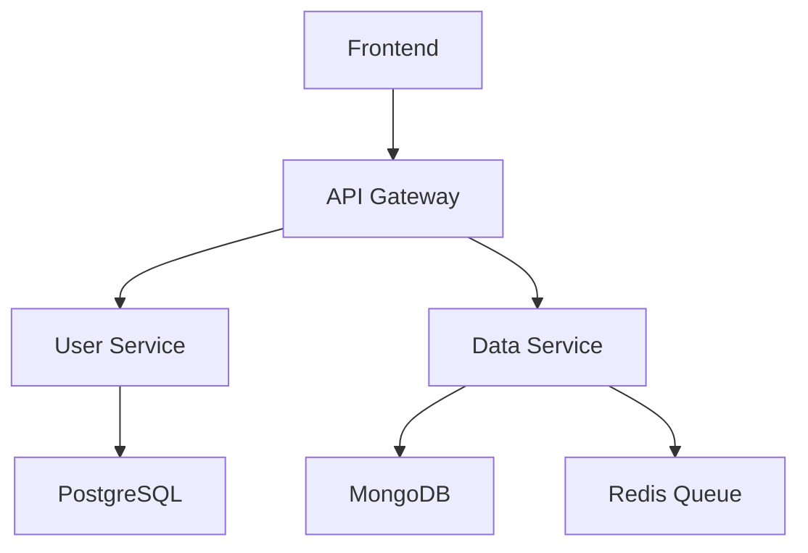

# Documentation Generation

## Context

Generate comprehensive technical documentation including API documentation, README files, code comments, architecture guides, and user manuals. Focus on creating clear, maintainable documentation that serves both developers and end users.

## Task

Create well-structured documentation that explains code functionality, usage patterns, and system architecture in a clear, accessible format.

## Requirements

- Clear, concise writing with appropriate technical depth
- Consistent formatting and structure across documents
- Code examples with proper syntax highlighting
- Logical information hierarchy and navigation
- Up-to-date and accurate technical details
- Appropriate audience targeting (developers, users, stakeholders)

## Documentation Types and Templates

### API Documentation

```markdown
# API Documentation

## Overview

Brief description of the API purpose and capabilities.

## Base URL
```

https://api.example.com/v1

````

## Authentication
Description of authentication method with examples.

## Endpoints

### GET /users
Retrieve user information.

**Parameters:**
- `id` (required): User ID
- `include` (optional): Related data to include

**Request Example:**
```bash
curl -H "Authorization: Bearer TOKEN" \
     https://api.example.com/v1/users/123?include=profile
````

**Response Example:**

```json
{
  "id": 123,
  "name": "John Doe",
  "email": "john@example.com",
  "profile": {
    "avatar": "https://cdn.example.com/avatar.jpg"
  }
}
```

**Error Responses:**

- `404`: User not found
- `401`: Unauthorized

````

### README Template
```markdown
# Project Name

Brief, compelling description of what this project does.

## Features
- Key feature 1
- Key feature 2
- Key feature 3

## Quick Start

### Prerequisites
- Node.js 18+
- PostgreSQL 13+
- Redis (optional)

### Installation
```bash
git clone https://github.com/user/repo.git
cd repo
npm install
cp .env.example .env
# Edit .env with your configuration
npm run dev
````

### Usage

Basic usage example:

```javascript
import { ApiClient } from "project-name";

const client = new ApiClient("your-api-key");
const result = await client.users.get(123);
```

## Documentation

- [API Reference](docs/api.md)
- [Configuration Guide](docs/config.md)
- [Deployment Guide](docs/deployment.md)

## Contributing

See [CONTRIBUTING.md](CONTRIBUTING.md) for development setup and guidelines.

## License

[MIT](LICENSE)

````

### Function/Class Documentation
```javascript
/**
 * Calculates the distance between two geographic coordinates using the Haversine formula.
 *
 * @param {number} lat1 - Latitude of the first point in decimal degrees
 * @param {number} lon1 - Longitude of the first point in decimal degrees
 * @param {number} lat2 - Latitude of the second point in decimal degrees
 * @param {number} lon2 - Longitude of the second point in decimal degrees
 * @param {string} [unit='km'] - Unit of measurement ('km', 'mi', 'm')
 * @returns {number} Distance between the two points in the specified unit
 *
 * @example
 * // Calculate distance between New York and London
 * const distance = calculateDistance(40.7128, -74.0060, 51.5074, -0.1278);
 * console.log(distance); // 5585.27 km
 *
 * @example
 * // Get distance in miles
 * const distanceInMiles = calculateDistance(
 *   40.7128, -74.0060,
 *   51.5074, -0.1278,
 *   'mi'
 * );
 *
 * @throws {Error} Throws an error if coordinates are invalid
 * @since 1.2.0
 */
function calculateDistance(lat1, lon1, lat2, lon2, unit = 'km') {
  // Implementation details...
}
````

### Architecture Documentation

````markdown
# System Architecture

## Overview

High-level description of the system architecture and design decisions.

## Components

### Frontend (React Application)

- **Purpose**: User interface and client-side logic
- **Technology**: React 18, TypeScript, Tailwind CSS
- **Key Features**: Responsive design, real-time updates, offline support

### API Gateway

- **Purpose**: Request routing, authentication, rate limiting
- **Technology**: AWS API Gateway / Nginx
- **Responsibilities**:
  - Route requests to appropriate services
  - Handle authentication and authorization
  - Implement rate limiting and caching

### Core Services

#### User Service

- **Responsibility**: User management and authentication
- **Database**: PostgreSQL users table
- **APIs**: REST endpoints for CRUD operations
- **Dependencies**: Email service, Redis for sessions

#### Data Processing Service

- **Responsibility**: Background data processing and analytics
- **Technology**: Node.js workers, Bull queue
- **Database**: MongoDB for analytics data
- **Scaling**: Horizontal scaling with Kubernetes

## Data Flow


````

## Deployment Architecture

Description of production deployment setup, including:

- Container orchestration (Kubernetes/Docker)
- Load balancing strategies
- Database replication and backup
- Monitoring and logging setup

```

## Documentation Best Practices

### Writing Guidelines
- **Clarity**: Use simple, direct language
- **Consistency**: Maintain consistent terminology and formatting
- **Completeness**: Cover all necessary information without being verbose
- **Examples**: Include practical, working examples
- **Structure**: Use clear headings and logical organization

### Code Documentation
- Document public APIs and complex algorithms
- Explain the "why" not just the "what"
- Include parameter types, return values, and exceptions
- Provide usage examples for complex functions
- Keep comments up-to-date with code changes

### Maintenance
- Review and update documentation with each release
- Use automated tools to validate code examples
- Gather feedback from documentation users
- Version documentation alongside code
- Archive outdated documentation appropriately

## Output Formats

### Markdown Documentation
- Use consistent heading hierarchy (H1 for title, H2 for main sections)
- Include table of contents for longer documents
- Use code fences with language specification
- Add badges for build status, version, etc.

### Inline Code Comments
- Follow language-specific documentation conventions (JSDoc, Sphinx, etc.)
- Include type information where applicable
- Use consistent comment formatting
- Document complex business logic and algorithms

### README Files
- Start with a compelling project description
- Include quick start instructions
- Provide clear installation and setup steps
- Link to detailed documentation
- Include contribution guidelines and license information

## Additional Context
- Consider the target audience when determining technical depth
- Use diagrams and visual aids for complex architectural concepts
- Implement documentation as code practices (version control, automated testing)
- Create templates for consistent documentation across projects
- Regular reviews to ensure accuracy and relevance
```
