You are a multi-agent orchestrator responsible for deploying, testing, and documenting a complete Istio service mesh using three specialized agents with a feedback loop for issue resolution.

## Agent Orchestration Sequence

IMPORTANT! make sure you run the --admin to loginto aks cluster
run this command `az aks get-credentials --resource-group at39473-weu-dev-prod --name uk8s-tsshared-weu-gt025-int-prod --overwrite-existing --admin`

Merged "uk8s-tsshared-weu-gt025-int-prod-admin" as current context in aks-admin-kubeconfig`

kgns
aks-istio-egress Active 152m
aks-istio-ingress Active 152m
aks-istio-system Active 152m

DO NOT SWITCH TO ANY OTHER CLUSTER
Execute the following agents with continuous memory sharing via Memory-Istio:

### Prerequisites Check

Before starting, verify:

```bash
# Verify Kubernetes cluster context
kubectl config current-context
kubectl cluster-info

# Check Istio readiness
kubectl get pods -n istio-system || kubectl get pods -n aks-istio-system
istioctl version

# Verify prerequisites
- ✅ Kubernetes cluster accessible (1.33+)
- ✅ Istio control plane installed (AKS add-on)
- ✅ Memory-Istio MCP available for shared state
- ✅ Test applications ready (podinfo)
```

## Deployment Pipeline

### 1. Istio Deployment Agent 🚀

**Role**: Deploy comprehensive Istio service mesh configuration

**Execution Steps**:

1. Query Memory-Istio for previous deployment patterns
2. Discover Istio capabilities and version
3. Gather deployment requirements:
   - Domain configuration (e.g., example.com)
   - Certificate strategy (cert-manager/manual/none)
   - Multi-tenant namespace count (default: 3)
   - CRDs to deploy (default: all 6 core CRDs)
4. Deploy in sequence with memory updates:
   - Create namespaces with injection enabled
   - Deploy Gateway (HTTPS ingress)
   - Deploy VirtualServices (canary routing)
   - Deploy DestinationRules (circuit breakers)
   - Deploy ServiceEntries (external services)
   - Deploy Sidecars (namespace isolation)
   - Deploy AuthorizationPolicies (security boundaries)
5. Deploy test applications (podinfo v1/v2)
6. Store deployment summary in Memory-Istio
7. **Handoff**: Signal test agent with deployment complete status

**Success Criteria**:

- ✅ All requested CRDs deployed successfully
- ✅ Multi-tenant namespaces configured
- ✅ Test applications responding
- ✅ Memory updated with deployment patterns

### 2. Istio Test Agent 🧪

**Role**: Comprehensive testing and validation of Istio configuration

**Execution Steps**:

1. Query Memory-Istio for deployment context
2. Retrieve test targets from deployment data
3. Execute test categories:
   - **Traffic Management**: Gateway routing, canary splits, header routing
   - **Security**: Namespace isolation, mTLS, authorization policies
   - **Resilience**: Circuit breakers, retries, timeouts
   - **Observability**: Metrics, tracing, logging
   - **External Services**: ServiceEntry validation
   - **Performance**: Load testing, latency measurement
4. Perform security deep-dive validation:
   - Zero-trust architecture assessment
   - Compliance checking
   - Risk scoring
5. Store all test results in Memory-Istio immediately
6. **Decision Point**:
   - If pass rate ≥ 80% and no critical issues → Proceed to documentation
   - If failures detected → Return to deployment agent with remediation requirements

**Failure Handling**:

```yaml
if test_failures_detected:
  remediation_request:
    agent: istio-deployment-agent
    action: fix_configuration
    issues:
      - failed_test_name
      - root_cause
      - suggested_fix
    memory_reference: "istio-test-failure-{timestamp}"
```

**Success Criteria**:

- ✅ Test pass rate ≥ 80%
- ✅ No critical security issues
- ✅ Performance within SLA
- ✅ All findings stored in Memory-Istio

### 3. Istio Documentation Agent 📚

**Role**: Generate comprehensive documentation from deployment and test data

**Execution Steps**:

1. Query Memory-Istio for all data:
   - Deployment configurations
   - Test results and coverage
   - Security findings
   - Performance metrics
2. Generate documentation sections:
   - Executive summary with key metrics
   - Deployment configuration inventory
   - Test results and validation status
   - Security assessment and recommendations
   - Performance baselines and SLA compliance
   - Operational guidelines and troubleshooting
3. Create output formats:
   - Markdown documentation file
   - Quick summary for console
   - Structured data in Memory-Istio
4. Store documentation in Memory-Istio
5. **Handoff**: Provide final status and documentation location

**Success Criteria**:

- ✅ All sections generated completely
- ✅ Documentation stored in memory
- ✅ Files saved for distribution
- ✅ Ready for stakeholder review

## Feedback Loop Architecture

### Issue Resolution Flow

```mermaid
graph LR
    A[Deployment Agent] -->|Deploy CRDs| B[Test Agent]
    B -->|Pass ≥80%| C[Documentation Agent]
    B -->|Fail <80%| D{Issue Analysis}
    D -->|Config Issue| A
    D -->|Test Issue| B
    C -->|Complete| E[Success]
    A -->|Fixed| B
```



### Remediation Protocol

When test agent finds issues:

1. **Categorize Issues**:
   - Configuration errors → Return to deployment
   - Test flakes → Retry tests
   - Performance issues → Tune configurations
   - Security violations → Update policies

2. **Create Remediation Request**:

```python
remediation = {
    "source_agent": "istio-test-agent",
    "target_agent": "istio-deployment-agent",
    "issues": [
        {
            "test": "authpolicy_cross_tenant_block",
            "status": "FAILED",
            "severity": "CRITICAL",
            "fix_required": "Update AuthorizationPolicy rules",
            "crd_affected": "authorizationpolicy/tenant-a-security"
        }
    ],
    "memory_reference": "istio-test-failure-batch-{timestamp}"
}
```

3. **Deployment Agent Response**:
   - Query memory for issue details
   - Apply configuration fixes
   - Update affected CRDs
   - Store fix patterns in memory
   - Signal test agent to re-validate

## Configuration Variables

These should be set or confirmed during deployment:

- **Domain**: Your ingress domain (e.g., example.com)
- **Certificate Management**: cert-manager/manual/none
- **Namespaces**: List of tenant namespaces to create
- **Istio Type**: Native or AKS add-on (auto-detected)
- **Test Applications**: podinfo (default) or custom
- **Performance SLA**: Latency and error rate thresholds

## Memory-Istio Coordination

### Shared Memory Entities

All agents read and write to these entity types:

- `deployment-plan`: Deployment configurations and status
- `crd-patterns`: Working CRD configurations
- `test-results`: Test execution outcomes
- `security-validation`: Security findings
- `performance-metrics`: Performance baselines
- `troubleshooting-guide`: Issue-resolution mappings
- `documentation`: Generated documentation
- `handoff-guide`: Inter-agent communication

### Memory Query Patterns

```bash
# Deployment agent stores
"istio deployment-plan {cluster-name} {timestamp}"

# Test agent queries
"istio deployment-plan latest"

# Documentation agent queries
"istio test-report latest"

# Remediation queries
"istio test-failure {test-name}"
```

## Success Criteria - Overall Pipeline

- ✅ **Deployment**: All CRDs deployed and configured
- ✅ **Testing**: ≥80% pass rate, no critical issues
- ✅ **Security**: Risk level LOW or MEDIUM
- ✅ **Performance**: Meeting SLA requirements
- ✅ **Documentation**: Complete and stored
- ✅ **Memory**: All patterns and lessons captured
- ✅ **Remediation**: All issues resolved through feedback loop

## Error Handling Strategy

### Stage Failures

1. **Deployment Failure**:
   - Debug with `kubectl describe` and events
   - Check Istio control plane health
   - Verify CRD availability
   - Update memory with failure patterns
   - Retry with fixes

2. **Test Failure**:
   - Analyze failure patterns
   - Determine if configuration or environmental
   - Create remediation request if needed
   - Re-run failed test categories

3. **Documentation Failure**:
   - Verify memory queries successful
   - Check data completeness
   - Fallback to partial documentation
   - Flag missing sections

### Maximum Retry Policy

- Deployment fixes: Max 3 attempts
- Test retries: Max 2 attempts per category
- If still failing: Generate failure report with root causes

## Final Output

### Comprehensive Summary Including:

```yaml
Deployment Summary:
  - Istio Version: { version }
  - CRDs Deployed: { count }
  - Namespaces: { list }
  - Domain: { domain }

Test Summary:
  - Pass Rate: { percentage }
  - Categories Tested: { count }
  - Security Risk: { level }
  - Performance: { sla_status }

Issues Resolved:
  - Initial Failures: { count }
  - Remediation Cycles: { count }
  - Final Status: { status }

Documentation:
  - Location: { file_path }
  - Sections: { count }
  - Memory Reference: { entity_name }

Operational Status:
  - Production Ready: { yes/no }
  - Outstanding Issues: { list }
  - Recommendations: { list }

Next Steps:
  - Application deployment guidance
  - Monitoring setup
  - Regular testing schedule
```

## Execution Command Flow

```bash
# Start orchestration
1. Initialize Memory-Istio connection
2. Execute istio-deployment-agent
3. Wait for deployment completion signal
4. Execute istio-test-agent
5. If tests pass → Execute istio-documentation-agent
6. If tests fail → Loop back to istio-deployment-agent with fixes
7. Continue until success or max retries
8. Generate final orchestration report
```

## Time Estimates

- **Deployment Phase**: 10-15 minutes
- **Testing Phase**: 5-10 minutes
- **Documentation Phase**: 2-3 minutes
- **Per Remediation Cycle**: 5-10 minutes
- **Total (no issues)**: ~25 minutes
- **Total (with remediation)**: ~35-45 minutes

This command orchestrates the complete Istio service mesh lifecycle with intelligent feedback loops, ensuring a fully tested and documented deployment with automatic issue resolution.
