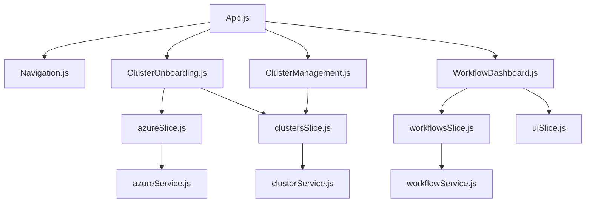
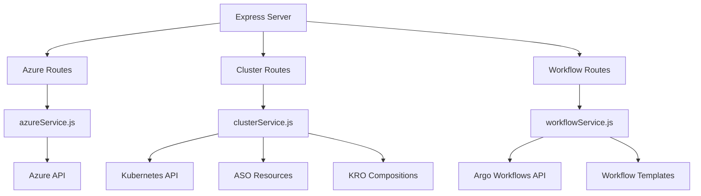
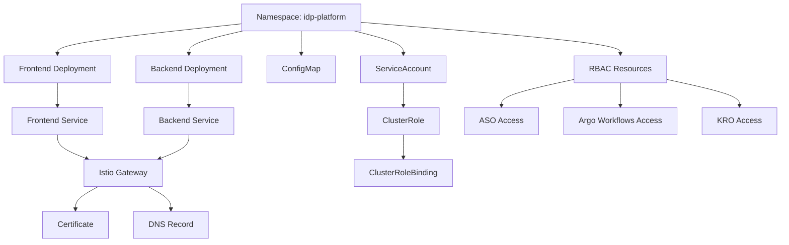
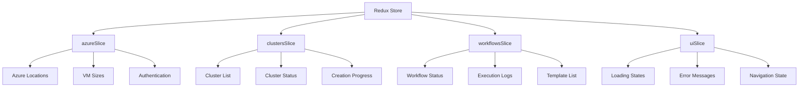
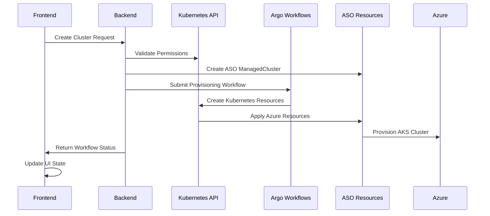
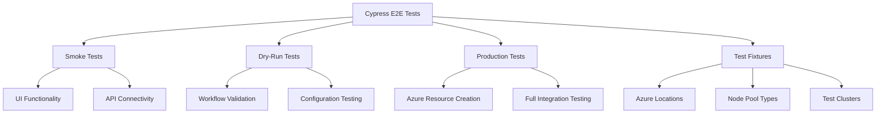

# AKS Deployment Design for IDP Platform

## Overview

This document outlines the deployment architecture for the Internal Developer Platform (IDP) to Azure Kubernetes Service (AKS). The IDP provides a self-service portal for AKS cluster onboarding with integration to Azure Service Operator (ASO), Argo Workflows, and Kubernetes Resource Orchestrator (KRO).

### Target Environment
- **Platform**: Azure Kubernetes Service (AKS)
- **DNS Management**: External-DNS with Azure DNS (davidmarkgardiner.co.uk)
- **Certificate Management**: Cert-Manager with Let's Encrypt wildcards
- **Infrastructure**: Flux-managed GitOps deployment
- **Container Registry**: Docker Hub public registry

## Technology Stack & Dependencies

### Frontend Application
- **Framework**: React 18.2.0 with Material-UI 5.x
- **State Management**: Redux Toolkit with multiple slices
- **Routing**: React Router DOM v6
- **API Client**: Axios for HTTP communication
- **Testing**: Cypress E2E testing framework

### Backend Services
- **Runtime**: Node.js Express server
- **Kubernetes Integration**: @kubernetes/client-node
- **Security**: CORS, Helmet middleware
- **Validation**: Joi schema validation
- **WebSocket**: Real-time workflow updates

### Infrastructure Dependencies
- Azure Service Operator (ASO) v2.5.0
- Argo Workflows (latest)
- Kubernetes Resource Orchestrator (KRO)
- External-DNS with Azure DNS provider
- Cert-Manager with Let's Encrypt ClusterIssuer

## Component Architecture

### Frontend Component Hierarchy



### Backend Service Architecture



## Deployment Architecture

### Container Strategy

#### Frontend Container
```dockerfile
# Multi-stage build for React application
FROM node:18-alpine AS builder
WORKDIR /app
COPY frontend/package*.json ./
RUN npm ci
COPY frontend/ .
RUN npm run build

FROM nginx:alpine
COPY --from=builder /app/build /usr/share/nginx/html
COPY nginx.conf /etc/nginx/conf.d/default.conf
EXPOSE 80
```

#### Backend Container
```dockerfile
# Node.js backend with security hardening
FROM node:18-alpine
WORKDIR /app
COPY backend/package*.json ./
RUN npm ci --only=production
COPY backend/src/ ./src/
RUN addgroup -g 1001 -S nodejs && adduser -S nodejs -u 1001
USER nodejs
EXPOSE 3001
CMD ["node", "src/index.js"]
```

### Kubernetes Resource Architecture



### Network and Ingress Configuration

#### Istio Gateway Configuration
```yaml
apiVersion: networking.istio.io/v1beta1
kind: Gateway
metadata:
  name: idp-gateway
  namespace: idp-platform
spec:
  selector:
    app: aks-istio-ingressgateway-external
  servers:
  - port:
      number: 443
      name: https
      protocol: HTTPS
    tls:
      mode: SIMPLE
      credentialName: idp-wildcard-tls-cert
    hosts:
    - idp.davidmarkgardiner.co.uk
```

#### VirtualService Configuration
```yaml
apiVersion: networking.istio.io/v1beta1
kind: VirtualService
metadata:
  name: idp-virtualservice
  namespace: idp-platform
  annotations:
    external-dns.alpha.kubernetes.io/hostname: idp.davidmarkgardiner.co.uk
    external-dns.alpha.kubernetes.io/ttl: "300"
spec:
  hosts:
  - idp.davidmarkgardiner.co.uk
  gateways:
  - idp-gateway
  http:
  - match:
    - uri:
        prefix: "/api"
    route:
    - destination:
        host: idp-backend-service
        port:
          number: 3001
  - match:
    - uri:
        prefix: "/"
    route:
    - destination:
        host: idp-frontend-service
        port:
          number: 80
```

### Certificate Management

#### Wildcard Certificate Resource
```yaml
apiVersion: cert-manager.io/v1
kind: Certificate
metadata:
  name: idp-wildcard-cert
  namespace: idp-platform
spec:
  secretName: idp-wildcard-tls-cert
  issuerRef:
    name: letsencrypt-prod-dns01
    kind: ClusterIssuer
  dnsNames:
  - "idp.davidmarkgardiner.co.uk"
  - "*.idp.davidmarkgardiner.co.uk"
  usages:
  - digital signature
  - key encipherment
  duration: 2160h # 90 days
  renewBefore: 360h # 15 days
```

## State Management & Data Flow

### Frontend State Architecture


### API Data Flow


## Security & RBAC Configuration

### ServiceAccount Permissions
```yaml
apiVersion: rbac.authorization.k8s.io/v1
kind: ClusterRole
metadata:
  name: idp-backend-role
rules:
- apiGroups: [""]
  resources: ["pods", "services", "namespaces", "configmaps", "secrets"]
  verbs: ["get", "list", "watch", "create", "update", "patch", "delete"]
- apiGroups: ["argoproj.io"]
  resources: ["workflows", "workflowtemplates", "workflowtaskresults"]
  verbs: ["get", "list", "watch", "create", "update", "patch", "delete"]
- apiGroups: ["resources.azure.com"]
  resources: ["*"]
  verbs: ["get", "list", "watch", "create", "update", "patch", "delete"]
- apiGroups: ["kro.run"]
  resources: ["*"]
  verbs: ["get", "list", "watch", "create", "update", "patch", "delete"]
```

### Container Security Context
```yaml
securityContext:
  runAsNonRoot: true
  runAsUser: 1001
  fsGroup: 1001
  readOnlyRootFilesystem: true
  allowPrivilegeEscalation: false
  capabilities:
    drop:
    - ALL
```

## Configuration Management

### Environment Configuration
```yaml
apiVersion: v1
kind: ConfigMap
metadata:
  name: idp-config
  namespace: idp-platform
data:
  NODE_ENV: "production"
  PORT: "3001"
  CORS_ORIGIN: "https://idp.davidmarkgardiner.co.uk"
  LOG_LEVEL: "info"
  NAMESPACE_DEFAULT: "default"
  NAMESPACE_AZURE: "azure-system"
  NAMESPACE_ARGO: "argo"
  K8S_CLUSTER_CONTEXT: "current"
```

### Flux GitOps Integration
```yaml
apiVersion: source.toolkit.fluxcd.io/v1beta2
kind: GitRepository
metadata:
  name: idp-platform-source
  namespace: flux-system
spec:
  interval: 1m
  url: https://github.com/your-org/idp-platform
  ref:
    branch: main
---
apiVersion: kustomize.toolkit.fluxcd.io/v1beta2
kind: Kustomization
metadata:
  name: idp-platform
  namespace: flux-system
spec:
  interval: 5m
  sourceRef:
    kind: GitRepository
    name: idp-platform-source
  path: "./k8s-manifests"
  prune: true
  wait: true
```

## Resource Requirements & Scaling

### Frontend Resources
- **Requests**: 100m CPU, 128Mi memory
- **Limits**: 200m CPU, 256Mi memory
- **Replicas**: 2 (High Availability)
- **Auto-scaling**: HPA based on CPU utilization

### Backend Resources
- **Requests**: 250m CPU, 256Mi memory
- **Limits**: 500m CPU, 512Mi memory
- **Replicas**: 2 (High Availability)
- **Auto-scaling**: HPA based on CPU and memory

### Storage Requirements
- **Persistent Volumes**: Not required (stateless application)
- **ConfigMaps**: Environment configuration
- **Secrets**: TLS certificates, API credentials

## Monitoring & Health Checks

### Application Health Probes
```yaml
livenessProbe:
  httpGet:
    path: /health
    port: 3001
  initialDelaySeconds: 30
  periodSeconds: 10
  timeoutSeconds: 5
  failureThreshold: 3

readinessProbe:
  httpGet:
    path: /health
    port: 3001
  initialDelaySeconds: 5
  periodSeconds: 5
  timeoutSeconds: 3
  failureThreshold: 3
```

### Service Mesh Integration
- Istio sidecar injection for traffic management
- Distributed tracing with Jaeger
- Metrics collection with Prometheus
- Service-to-service mTLS encryption

## Testing Strategy

### End-to-End Testing Architecture


### Testing Environments
- **Smoke Tests**: 5-10 minutes, basic functionality
- **Dry-Run Tests**: 10-15 minutes, workflow simulation
- **Production Tests**: 20-60 minutes, full Azure integration

## Deployment Process

### Pre-Deployment Checklist
1. ✅ AKS cluster with Flux-system installed
2. ✅ Azure Service Operator deployed
3. ✅ Argo Workflows installed
4. ✅ KRO (Kubernetes Resource Orchestrator) installed
5. ✅ External-DNS configured for davidmarkgardiner.co.uk
6. ✅ Cert-Manager with wildcard certificate capability
7. ✅ Istio service mesh (if using Istio ingress)

### Deployment Automation Script
```bash
#!/bin/bash
# Deployment automation for IDP Platform

set -euo pipefail

REGISTRY="docker.io"
NAMESPACE="idp-platform"
DOMAIN="idp.davidmarkgardiner.co.uk"

# Build and push container images
docker build -f k8s-manifests/Dockerfile.frontend -t ${REGISTRY}/idp-frontend:latest .
docker build -f k8s-manifests/Dockerfile.backend -t ${REGISTRY}/idp-backend:latest .

docker push ${REGISTRY}/idp-frontend:latest
docker push ${REGISTRY}/idp-backend:latest

# Apply Kubernetes manifests
kubectl apply -f k8s-manifests/namespace.yaml
kubectl apply -f k8s-manifests/configmap.yaml
kubectl apply -f k8s-manifests/rbac.yaml
kubectl apply -f k8s-manifests/deployment.yaml
kubectl apply -f k8s-manifests/service.yaml
kubectl apply -f k8s-manifests/certificate.yaml
kubectl apply -f k8s-manifests/istio-gateway.yaml
kubectl apply -f k8s-manifests/virtualservice.yaml

# Wait for deployment
kubectl rollout status deployment/idp-frontend -n ${NAMESPACE}
kubectl rollout status deployment/idp-backend -n ${NAMESPACE}

echo "IDP Platform deployed successfully to ${DOMAIN}"
```

### Post-Deployment Verification
1. **DNS Resolution**: Verify idp.davidmarkgardiner.co.uk resolves correctly
2. **TLS Certificate**: Check certificate validity and auto-renewal
3. **Application Health**: Validate frontend and backend health endpoints
4. **API Connectivity**: Test backend Kubernetes API access
5. **Workflow Execution**: Verify Argo Workflows integration
6. **Azure Integration**: Test ASO resource creation capabilities

## Operational Considerations

### Log Aggregation
- Structured JSON logging in backend services
- Frontend error boundary with error reporting
- Centralized log collection via Fluent Bit
- Log retention policy aligned with compliance requirements

### Backup and Recovery
- GitOps repository backup for configuration
- Kubernetes resource backup via Velero
- Database backup (if persistent storage added)
- Disaster recovery runbooks

### Performance Optimization
- React code splitting for reduced bundle size
- API response caching with appropriate TTL
- Kubernetes resource requests/limits tuning
- CDN integration for static assets

### Compliance and Governance
- Security scanning of container images
- Kubernetes security policies enforcement
- Audit logging for administrative actions
- Regular dependency updates and vulnerability patching