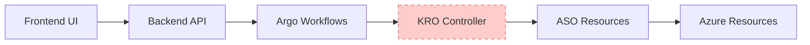
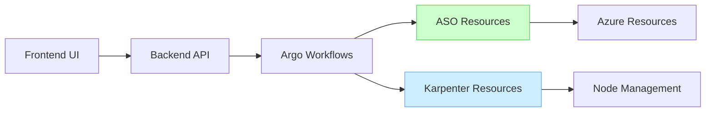
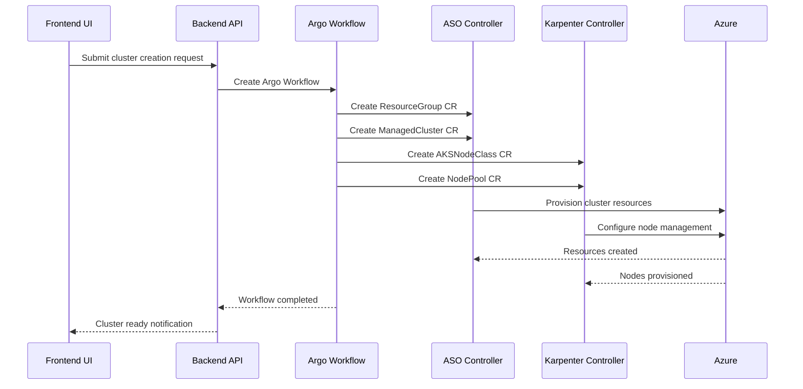
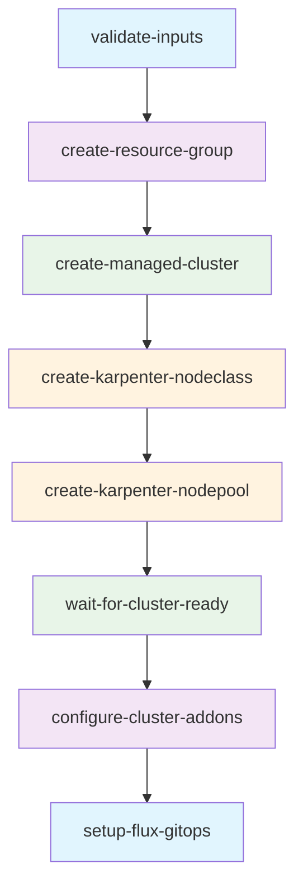
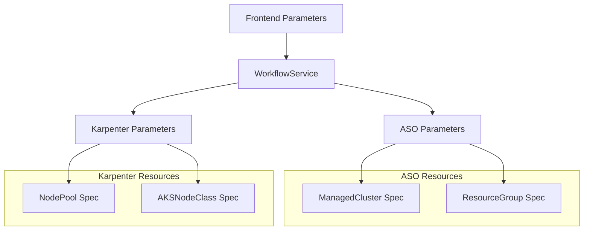
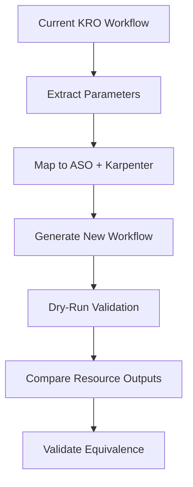

# IDP Platform: Argo Workflow Karpenter Integration Design

## Overview

This design document outlines the migration strategy for the IDP platform's AKS cluster provisioning workflow from KRO (Kubernetes Resource Orchestrator) composition to direct ASO (Azure Service Operator) + Karpenter integration. The migration eliminates the complexity layer introduced by KRO while leveraging Karpenter's advanced node management capabilities for superior autoscaling and cost optimization.

### Current Architecture



### Target Architecture



## Architecture

### Migration Strategy

The migration follows a three-phase approach to ensure minimal disruption and maximum reliability:

**Phase 1: Workflow Template Updates**
- Replace KRO AKSCluster creation with direct ASO ManagedCluster resources
- Integrate Karpenter NodePool and AKSNodeClass resources
- Maintain existing validation and monitoring capabilities

**Phase 2: Backend Service Adaptation**
- Update WorkflowService to generate ASO and Karpenter configurations
- Remove KRO-specific parameter mapping
- Enhance parameter validation for direct Azure resource management

**Phase 3: Cleanup and Optimization**
- Remove KRO dependencies and permissions
- Optimize RBAC for ASO and Karpenter operations
- Update documentation and validation scripts

### Component Integration



## Argo Workflow Template Design

### Core Workflow Structure

The updated workflow template eliminates KRO dependencies and directly manages ASO and Karpenter resources:



### Resource Templates

#### ASO ManagedCluster Template
Direct cluster provisioning with integrated NAP support:

```yaml
apiVersion: containerservice.azure.com/v1api20240402preview
kind: ManagedCluster
metadata:
  name: "{{inputs.parameters.cluster-name}}"
  namespace: azure-system
spec:
  location: "{{inputs.parameters.location}}"
  owner:
    name: "rg-{{inputs.parameters.cluster-name}}"
  identity:
    type: SystemAssigned
  
  # Node Auto Provisioning Configuration
  nodeProvisioningProfile:
    mode: "{{if eq inputs.parameters.enable-nap \"true\"}}Auto{{else}}Manual{{end}}"
  
  # System Node Pool (minimal when NAP enabled)
  agentPoolProfiles:
    - name: systempool
      mode: System
      count: 1
      vmSize: "{{inputs.parameters.system-vm-size}}"
      enableAutoScaling: "{{if eq inputs.parameters.enable-nap \"true\"}}false{{else}}true{{end}}"
      minCount: 1
      maxCount: 3
  
  kubernetesVersion: "{{inputs.parameters.kubernetes-version}}"
```

#### Karpenter AKSNodeClass Template
Azure-specific node configuration for Karpenter:

```yaml
apiVersion: karpenter.azure.com/v1alpha2
kind: AKSNodeClass
metadata:
  name: "{{inputs.parameters.cluster-name}}-nodeclass"
spec:
  location: "{{inputs.parameters.location}}"
  resourceGroup: "rg-{{inputs.parameters.cluster-name}}"
  subnetName: "aks-subnet"
  
  # Instance types based on node pool type
  instanceTypes:
    - "{{inputs.parameters.primary-vm-size}}"
    - "{{inputs.parameters.secondary-vm-size}}"
  
  # Azure-specific configurations
  osDisk:
    sizeGb: 100
    type: Premium_LRS
  
  userData: |
    #!/bin/bash
    # Custom node initialization script
    echo "Node initialized by Karpenter"
```

#### Karpenter NodePool Template
Dynamic node pool management configuration:

```yaml
apiVersion: karpenter.sh/v1beta1
kind: NodePool
metadata:
  name: "{{inputs.parameters.cluster-name}}-nodepool"
spec:
  template:
    metadata:
      labels:
        node-pool-type: "{{inputs.parameters.node-pool-type}}"
        cluster-name: "{{inputs.parameters.cluster-name}}"
    
    spec:
      # Node class reference
      nodeClassRef:
        kind: AKSNodeClass
        name: "{{inputs.parameters.cluster-name}}-nodeclass"
      
      # Resource requirements
      requirements:
        - key: "karpenter.azure.com/sku-family"
          operator: In
          values: ["{{inputs.parameters.sku-family}}"]
        - key: "kubernetes.io/arch"
          operator: In
          values: ["amd64"]
        - key: "node.kubernetes.io/instance-type"
          operator: In
          values: 
            - "{{inputs.parameters.primary-vm-size}}"
            - "{{inputs.parameters.secondary-vm-size}}"
      
      # Taints for specialized workloads
      taints:
        - key: "{{inputs.parameters.node-pool-type}}"
          value: "true"
          effect: NoSchedule
  
  # Disruption settings
  disruption:
    consolidationPolicy: WhenEmpty
    consolidateAfter: 30s
    expireAfter: 2160h # 90 days
  
  # Scaling limits
  limits:
    cpu: "{{inputs.parameters.max-cpu}}"
    memory: "{{inputs.parameters.max-memory}}"
```

## Backend Service Updates

### WorkflowService Modifications

The WorkflowService requires updates to support direct ASO and Karpenter resource generation:

#### Parameter Mapping

```javascript
// Node pool type to VM size mapping
const NODE_POOL_CONFIGURATIONS = {
  'standard': {
    primaryVmSize: 'Standard_DS2_v2',
    secondaryVmSize: 'Standard_DS3_v2',
    skuFamily: 'D',
    maxCpu: '1000',
    maxMemory: '1000Gi'
  },
  'memory-optimized': {
    primaryVmSize: 'Standard_E2s_v3',
    secondaryVmSize: 'Standard_E4s_v3',
    skuFamily: 'E',
    maxCpu: '1000',
    maxMemory: '2000Gi'
  },
  'compute-optimized': {
    primaryVmSize: 'Standard_F2s_v2',
    secondaryVmSize: 'Standard_F4s_v2',
    skuFamily: 'F',
    maxCpu: '2000',
    maxMemory: '1000Gi'
  }
};
```

#### Workflow Parameter Generation

```javascript
async function generateWorkflowParameters(clusterConfig) {
  const nodePoolConfig = NODE_POOL_CONFIGURATIONS[clusterConfig.nodePoolType];
  
  return {
    'cluster-name': clusterConfig.clusterName,
    'location': clusterConfig.location,
    'node-pool-type': clusterConfig.nodePoolType,
    'enable-nap': clusterConfig.enableNAP.toString(),
    'dry-run': clusterConfig.dryRun.toString(),
    'kubernetes-version': clusterConfig.kubernetesVersion,
    'primary-vm-size': nodePoolConfig.primaryVmSize,
    'secondary-vm-size': nodePoolConfig.secondaryVmSize,
    'sku-family': nodePoolConfig.skuFamily,
    'max-cpu': nodePoolConfig.maxCpu,
    'max-memory': nodePoolConfig.maxMemory,
    'system-vm-size': 'Standard_B2s' // Minimal system pool
  };
}
```

## RBAC Configuration Updates

### Updated ClusterRole Permissions

The RBAC configuration requires updates to support Karpenter resources while removing KRO permissions:

```yaml
apiVersion: rbac.authorization.k8s.io/v1
kind: ClusterRole
metadata:
  name: idp-backend-workflow-manager
rules:
# Argo Workflows permissions (unchanged)
- apiGroups: ["argoproj.io"]
  resources: ["workflows", "workflowtemplates", "cronworkflows", "workflowartifactgctasks"]
  verbs: ["get", "list", "watch", "create", "update", "patch", "delete"]

# ASO permissions (unchanged)
- apiGroups: ["resources.azure.com"]
  resources: ["*"]
  verbs: ["get", "list", "watch", "create", "update", "patch", "delete"]
- apiGroups: ["containerservice.azure.com"]
  resources: ["*"]
  verbs: ["get", "list", "watch", "create", "update", "patch", "delete"]

# Karpenter permissions (new)
- apiGroups: ["karpenter.sh"]
  resources: ["nodepools", "nodeclaims"]
  verbs: ["get", "list", "watch", "create", "update", "patch", "delete"]
- apiGroups: ["karpenter.azure.com"]
  resources: ["aksnodeclasses"]
  verbs: ["get", "list", "watch", "create", "update", "patch", "delete"]

# Remove KRO permissions (deleted)
# - apiGroups: ["kro.run"]
#   resources: ["*"]
#   verbs: ["get", "list", "watch", "create", "update", "patch", "delete"]
```

## Resource Composition Mapping

### KRO to Direct ASO + Karpenter Mapping

The following table maps current KRO composition elements to the new direct approach:

| KRO Resource | Direct Replacement | Responsibility |
|-------------|-------------------|----------------|
| ResourceGroup | ASO ResourceGroup | Argo Workflow |
| ManagedIdentity | ASO UserAssignedIdentity | Argo Workflow |
| ManagedCluster (basic) | ASO ManagedCluster | Argo Workflow |
| Node Pool Management | Karpenter NodePool | Karpenter Controller |
| VM Size Selection | AKSNodeClass | Karpenter Controller |
| Auto-scaling Logic | NodePool Disruption Policy | Karpenter Controller |

### Parameter Translation



## Node Pool Type Configurations

### Standard Node Pool
- **Primary VM**: Standard_DS2_v2 (2 vCPU, 7 GB RAM)
- **Secondary VM**: Standard_DS3_v2 (4 vCPU, 14 GB RAM)
- **Use Case**: General workloads, web applications, microservices
- **Karpenter Configuration**: Balanced CPU/memory requirements

### Memory-Optimized Node Pool
- **Primary VM**: Standard_E2s_v3 (2 vCPU, 16 GB RAM)
- **Secondary VM**: Standard_E4s_v3 (4 vCPU, 32 GB RAM)
- **Use Case**: In-memory databases, caches, analytics
- **Karpenter Configuration**: High memory requirements, specialized taints

### Compute-Optimized Node Pool
- **Primary VM**: Standard_F2s_v2 (2 vCPU, 4 GB RAM)
- **Secondary VM**: Standard_F4s_v2 (4 vCPU, 8 GB RAM)
- **Use Case**: CPU-intensive workloads, batch processing
- **Karpenter Configuration**: High CPU requirements, compute taints

## Validation Strategy

### Pre-Migration Validation



### Post-Migration Testing

1. **Dry-Run Mode Testing**
   - Validate all workflow steps execute without errors
   - Verify resource manifests are generated correctly
   - Confirm parameter passing between workflow steps

2. **Integration Testing**
   - Test with actual Azure resources (non-production subscription)
   - Verify Karpenter node provisioning
   - Validate cluster functionality and connectivity

3. **Rollback Capability**
   - Maintain KRO workflow as backup during transition period
   - Implement feature flag for workflow selection
   - Document rollback procedures

## Migration Timeline

### Phase 1: Development (Week 1)
- Update Argo Workflow templates
- Modify backend service parameter mapping
- Update RBAC configurations
- Implement dry-run testing

### Phase 2: Testing (Week 2)
- Comprehensive dry-run testing
- Integration testing with test Azure subscription
- Performance validation
- Documentation updates

### Phase 3: Deployment (Week 3)
- Production deployment with feature flag
- Gradual rollout with monitoring
- Validation of production workflows
- KRO cleanup (after validation period)

## Risk Mitigation

### Technical Risks

1. **Azure Resource Compatibility**
   - **Risk**: ASO version incompatibility with required Azure features
   - **Mitigation**: Version compatibility matrix validation, upgrade path planning

2. **Karpenter Azure Integration**
   - **Risk**: Karpenter-Azure provider limitations or bugs
   - **Mitigation**: Thorough testing, fallback to manual node pool management

3. **Workflow Complexity**
   - **Risk**: Increased workflow complexity with direct resource management
   - **Mitigation**: Comprehensive testing, clear error handling, detailed logging

### Operational Risks

1. **Migration Downtime**
   - **Risk**: Service interruption during migration
   - **Mitigation**: Blue-green deployment, feature flags, rollback procedures

2. **Configuration Drift**
   - **Risk**: Inconsistent cluster configurations post-migration
   - **Mitigation**: Configuration validation, standardized templates, monitoring

## Benefits Analysis

### Technical Benefits

1. **Simplified Architecture**
   - Elimination of KRO abstraction layer
   - Direct control over Azure resources
   - Reduced complexity in troubleshooting

2. **Enhanced Node Management**
   - Advanced Karpenter autoscaling algorithms
   - Multi-instance type support
   - Intelligent node consolidation and replacement

3. **Improved Reliability**
   - Battle-tested ASO for Azure integration
   - Mature Karpenter ecosystem
   - Reduced points of failure

### Operational Benefits

1. **Cost Optimization**
   - Karpenter's spot instance management
   - Dynamic right-sizing capabilities
   - Efficient node utilization

2. **Performance Improvements**
   - Faster node provisioning
   - Better workload placement
   - Reduced over-provisioning

3. **Maintenance Reduction**
   - Fewer components to maintain
   - Simplified dependency management
   - Clearer upgrade paths

## Monitoring and Observability

### Karpenter Metrics

Monitor key Karpenter performance indicators:

```yaml
# Key metrics to track
- karpenter_nodes_total
- karpenter_pods_startup_duration_seconds
- karpenter_disruption_replacement_node_initialized_seconds
- karpenter_voluntary_disruption_queue_depth
- karpenter_nodes_allocatable_memory_bytes
- karpenter_nodes_allocatable_cpu_cores
```

### ASO Resource Status

Track ASO resource provisioning and health:

```yaml
# Resource status monitoring
- aso_resource_reconcile_duration_seconds
- aso_resource_reconcile_errors_total
- aso_resource_ready_condition_status
- azure_api_request_duration_seconds
```

### Workflow Success Metrics

Monitor workflow execution patterns:

```yaml
# Workflow performance tracking
- argo_workflow_duration_seconds
- argo_workflow_success_rate
- cluster_provisioning_time_seconds
- cluster_ready_time_seconds
```