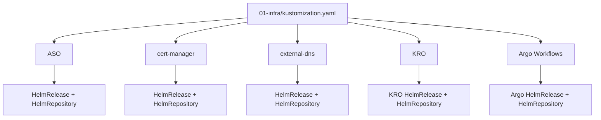
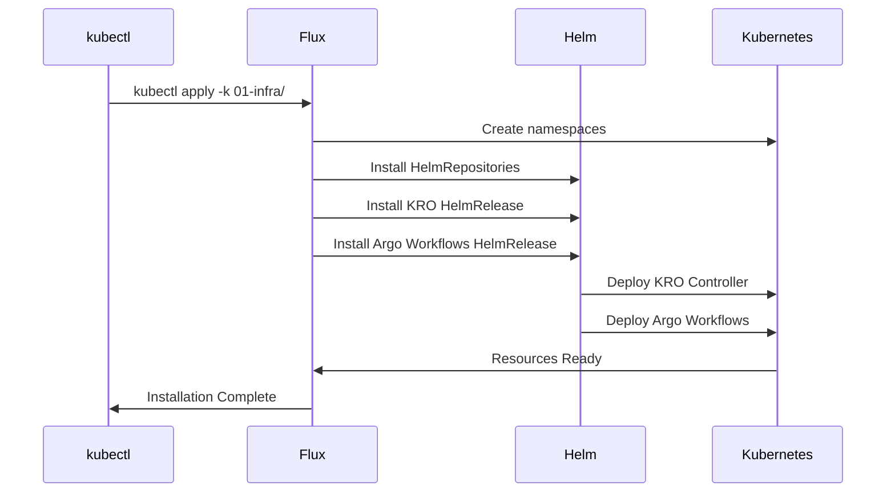

# Helm Release Setup for KRO and Argo Workflows

## Overview

This design document outlines the addition of Helm releases for KRO (Kubernetes Resource Operator) and Argo Workflows to the infrastructure kustomization layer. The goal is to enable installation of these critical platform components using `kubectl apply -k` on clusters with flux-system already installed.

## Current Infrastructure Architecture

The infrastructure follows a layered Kustomize structure:



## Component Requirements

### KRO (Kubernetes Resource Operator)
- **Purpose**: Enables composition of complex Azure resources from modular templates
- **Current Installation**: Direct YAML from GitHub (https://raw.githubusercontent.com/Azure/kro/main/config/install.yaml)
- **Target**: Helm-based installation using OCI registry for better lifecycle management
- **Version**: 0.4.1 (latest from ghcr.io/kro-run/kro/kro)
- **Namespace**: `kro`

### Argo Workflows
- **Purpose**: Workflow orchestration for cluster provisioning and management
- **Current Installation**: Direct YAML from GitHub releases
- **Target**: Helm-based installation with customizable configurations
- **Namespace**: `argo`

## Directory Structure Design

```
01-infra/
├── aso/
│   ├── helm-release.yaml
│   ├── helm-repository.yaml
│   ├── kustomization.yaml
│   └── namespace.yaml
├── cert-manager/
│   ├── helm-release.yaml
│   ├── helm-repository.yaml
│   ├── kustomization.yaml
│   └── namespace.yaml
├── external-dns/
│   ├── helm-release.yaml
│   ├── helm-repository.yaml
│   ├── kustomization.yaml
│   └── namespace.yaml
├── kro/                    # NEW
│   ├── helm-release.yaml   # NEW
│   ├── kustomization.yaml  # NEW
│   └── namespace.yaml      # NEW
├── argo-workflows/         # NEW
│   ├── helm-release.yaml   # NEW
│   ├── helm-repository.yaml # NEW
│   ├── kustomization.yaml  # NEW
│   └── namespace.yaml      # NEW
└── kustomization.yaml      # UPDATED
```

## KRO Helm Configuration

### Namespace Definition
```yaml
apiVersion: v1
kind: Namespace
metadata:
  name: kro
  labels:
    platform.io/layer: "01-infrastructure"
    platform.io/component: "kro"
    managed-by: flux
```

### OCIRepository Configuration
```yaml
apiVersion: source.toolkit.fluxcd.io/v1beta2
kind: OCIRepository
metadata:
  name: kro
  namespace: kro
spec:
  interval: 10m
  url: oci://ghcr.io/kro-run/kro/kro
  ref:
    tag: "0.4.1"
```

### HelmRelease Configuration
```yaml
apiVersion: helm.toolkit.fluxcd.io/v2beta1
kind: HelmRelease
metadata:
  name: kro
  namespace: kro
spec:
  interval: 10m
  chart:
    spec:
      chart: kro
      version: "0.4.1"
      sourceRef:
        kind: OCIRepository
        name: kro
        namespace: kro
  values:
    controller:
      resources:
        limits:
          cpu: 500m
          memory: 512Mi
        requests:
          cpu: 100m
          memory: 256Mi
    webhook:
      enabled: true
      port: 9443
```

## Argo Workflows Helm Configuration

### Namespace Definition
```yaml
apiVersion: v1
kind: Namespace
metadata:
  name: argo
  labels:
    platform.io/layer: "01-infrastructure"
    platform.io/component: "argo-workflows"
    managed-by: flux
```

### HelmRepository Configuration
```yaml
apiVersion: source.toolkit.fluxcd.io/v1beta1
kind: HelmRepository
metadata:
  name: argo
  namespace: argo
spec:
  interval: 10m
  url: https://argoproj.github.io/argo-helm
```

### HelmRelease Configuration
```yaml
apiVersion: helm.toolkit.fluxcd.io/v2beta1
kind: HelmRelease
metadata:
  name: argo-workflows
  namespace: argo
spec:
  interval: 10m
  chart:
    spec:
      chart: argo-workflows
      version: "0.41.0"
      sourceRef:
        kind: HelmRepository
        name: argo
        namespace: argo
  values:
    controller:
      resources:
        limits:
          cpu: 500m
          memory: 1Gi
        requests:
          cpu: 250m
          memory: 512Mi
    server:
      enabled: true
      resources:
        limits:
          cpu: 100m
          memory: 128Mi
        requests:
          cpu: 50m
          memory: 64Mi
      serviceType: ClusterIP
    workflow:
      serviceAccount:
        create: true
        name: argo-workflow
      rbac:
        create: true
```

## Updated Infrastructure Kustomization

```yaml
apiVersion: kustomize.config.k8s.io/v1beta1
kind: Kustomization

metadata:
  name: infrastructure
  annotations:
    config.kubernetes.io/local-config: "true"
    platform.io/description: "Base infrastructure operators and controllers"

# Deploy second - base operators
resources:
  - aso/
  - cert-manager/
  - external-dns/
  - kro/                    # NEW
  - argo-workflows/         # NEW

commonLabels:
  platform.io/layer: "01-infrastructure"
  platform.io/component: "infrastructure"
  managed-by: flux
```

## RBAC Considerations

### Service Account Requirements
Both KRO and Argo Workflows require extensive RBAC permissions for managing Kubernetes resources and Azure Service Operator objects.

```yaml
apiVersion: rbac.authorization.k8s.io/v1
kind: ClusterRole
metadata:
  name: infrastructure-operators
rules:
# KRO Resources
- apiGroups: ["kro.run"]
  resources: ["*"]
  verbs: ["*"]
# Argo Workflows Resources  
- apiGroups: ["argoproj.io"]
  resources: ["*"]
  verbs: ["*"]
# Azure Service Operator Resources
- apiGroups: ["resources.azure.com", "containerservice.azure.com"]
  resources: ["*"]
  verbs: ["*"]
```

## Installation Flow



## Validation Strategy

### Health Checks
1. **KRO Controller**: Verify controller pod is running in `kro` namespace
2. **Argo Workflows**: Verify controller and server pods are running in `argo` namespace
3. **CRDs**: Confirm all required CustomResourceDefinitions are installed
4. **RBAC**: Validate service accounts have necessary permissions

### Testing Commands
```bash
# Verify KRO installation
kubectl get pods -n kro
kubectl get crd resourcegroups.kro.run

# Verify Argo Workflows installation  
kubectl get pods -n argo
kubectl get crd workflows.argoproj.io

# Test KRO functionality
kubectl apply -f idp-platform/k8s-manifests/kro-resources/example-aks-cluster.yaml

# Test Argo Workflows functionality
kubectl apply -f idp-platform/k8s-manifests/argo-workflows/aks-cluster-provisioning.yaml
```

## Migration Considerations

### Backward Compatibility
- Existing clusters with manually installed KRO/Argo will need migration strategy
- Helm adoption should preserve existing configurations and CRDs
- Service accounts and RBAC configurations must be maintained

### Rollback Strategy
- Keep existing installation scripts as backup
- Document manual removal procedures for Helm releases
- Provide migration path back to YAML-based installation if needed

## Dependencies and Prerequisites

### Required Infrastructure
- Flux system installed and operational
- Azure Service Operator (ASO) deployed and configured  
- cert-manager for TLS certificate management
- external-dns for DNS automation

### Configuration Requirements
- Kubernetes cluster with RBAC enabled
- Sufficient resources for controller workloads
- Network policies allowing inter-namespace communication
- StorageClass available for persistent volumes (if needed)

## Monitoring and Observability

### Metrics Collection
- Controller metrics via Prometheus ServiceMonitor
- Workflow execution metrics and logs
- Resource utilization monitoring
- Error rate and success rate tracking

### Logging Strategy  
- Centralized logging for all infrastructure components
- Structured logging with correlation IDs
- Log retention policies for audit and debugging
- Integration with observability stack