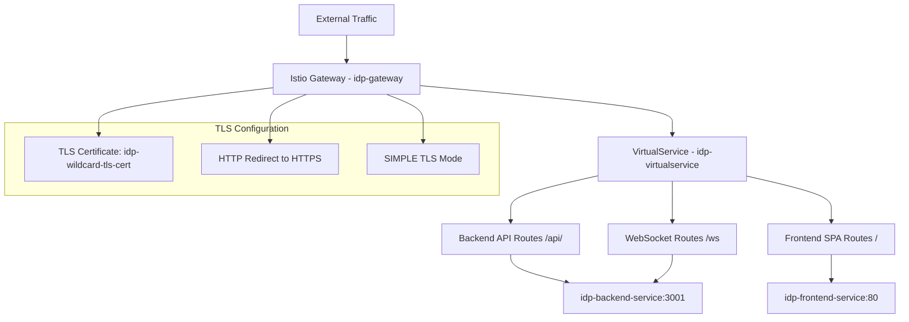
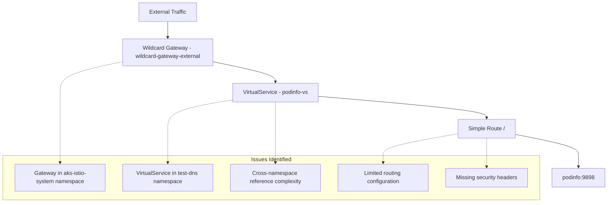
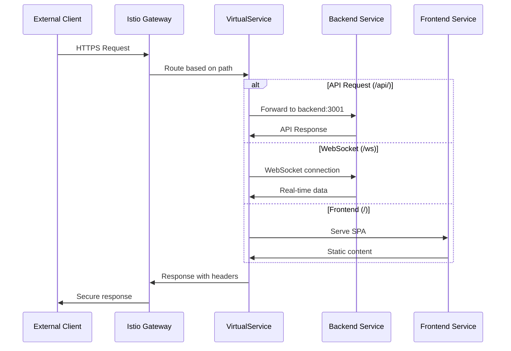
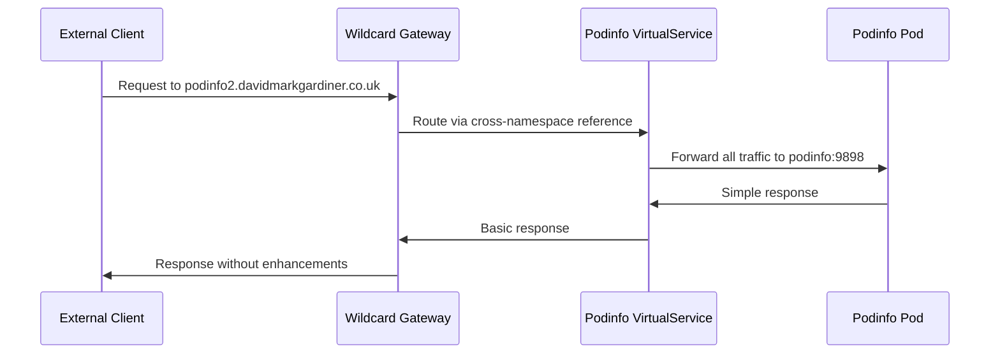
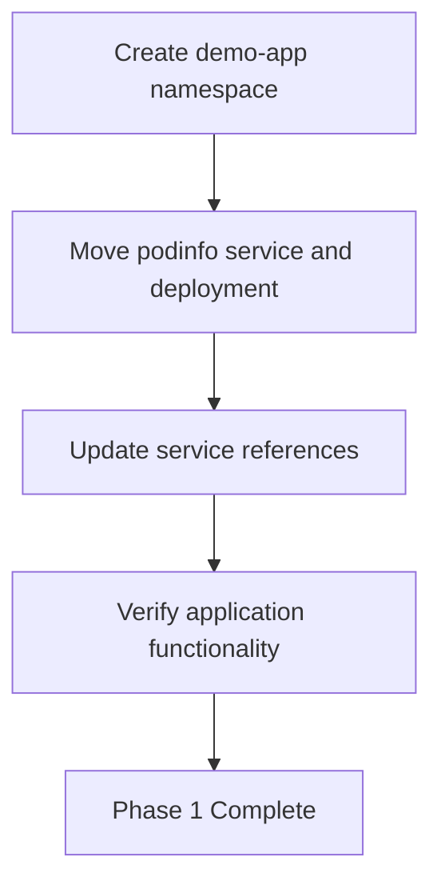
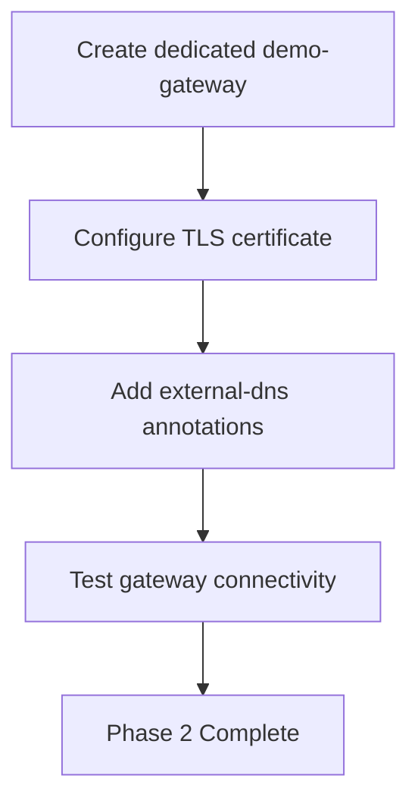
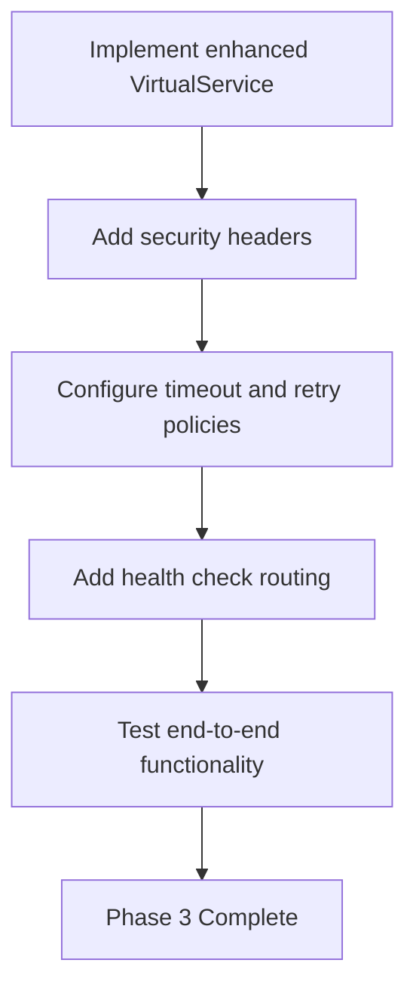

# Istio Configuration Analysis: IDP Platform vs Demo Application

## Overview

This document analyzes the Istio service mesh configuration differences between the IDP platform (successfully working) and the demo application (requiring fixes). The analysis identifies configuration gaps and provides solutions to align the demo application's Istio configuration with proven working patterns from the IDP platform.

## Current Configuration Analysis

### IDP Platform Configuration (Working)

The IDP platform demonstrates a complete, production-ready Istio configuration with the following characteristics:



#### Key Success Factors

1. **Complete Gateway Configuration**
   - Both HTTP (80) and HTTPS (443) ports defined
   - Automatic HTTP-to-HTTPS redirect
   - Proper TLS certificate reference
   - External DNS annotations for hostname management

2. **Comprehensive VirtualService Routing**
   - API route matching with `/api/` prefix
   - WebSocket support with `/ws` prefix and upgrade headers
   - Frontend SPA catch-all routing
   - Proper service destination mapping

3. **Production-Ready Features**
   - Request/response header manipulation
   - Timeout and retry configuration
   - Security headers (X-Frame-Options, X-Content-Type-Options)
   - Extended WebSocket timeout (300s)

### Demo Application Configuration (Incomplete)

The demo application configuration shows several critical gaps:



#### Identified Problems

1. **Namespace Inconsistency**
   - Gateway in `aks-istio-system` namespace
   - VirtualService in `test-dns` namespace
   - Cross-namespace gateway reference: `aks-istio-system/wildcard-gateway-external`

2. **Configuration Fragmentation**
   - Commented out internal gateway configuration
   - Inconsistent hostname configuration
   - Mismatched VirtualService hosts and gateway configuration

3. **Missing Production Features**
   - No timeout configuration
   - No retry policies
   - No security headers
   - No request/response header manipulation

## Architecture Comparison

### IDP Platform Architecture Pattern



### Demo Application Current Pattern



## Configuration Gap Analysis

| Feature | IDP Platform | Demo Application | Impact |
|---------|--------------|------------------|---------|
| Namespace Strategy | Single namespace (`idp-platform`) | Cross-namespace (`aks-istio-system` → `test-dns`) | Complexity, potential security issues |
| Gateway Configuration | Complete with both protocols | Complete but separate namespace | Works but suboptimal |
| VirtualService Routing | Multi-path with specialized handling | Single catch-all route | Limited functionality |
| TLS Configuration | Proper certificate reference | Uses shared wildcard cert | Security and management concerns |
| Header Management | Comprehensive request/response headers | No header manipulation | Missing security and debugging features |
| Timeout/Retry Policy | Configured for production | Not configured | Reliability issues |
| WebSocket Support | Explicit WebSocket routing | Not supported | Limited real-time capabilities |

## Recommended Solutions

### Solution 1: Namespace Consolidation (Recommended)

Consolidate all demo application resources into a single namespace to follow the IDP platform pattern:

```yaml
# Updated namespace strategy
apiVersion: v1
kind: Namespace
metadata:
  name: demo-app
  labels:
    istio-injection: enabled
    platform.io/component: demo-application
```

```yaml
# Demo application gateway in demo-app namespace
apiVersion: networking.istio.io/v1beta1
kind: Gateway
metadata:
  name: demo-gateway
  namespace: demo-app
  annotations:
    external-dns.alpha.kubernetes.io/hostname: "demo.davidmarkgardiner.co.uk"
    external-dns.alpha.kubernetes.io/ttl: "300"
spec:
  selector:
    app: aks-istio-ingressgateway-external
    istio: aks-istio-ingressgateway-external
  servers:
  - port:
      number: 80
      name: http
      protocol: HTTP
    hosts:
    - "demo.davidmarkgardiner.co.uk"
    tls:
      httpsRedirect: true
  - port:
      number: 443
      name: https
      protocol: HTTPS
    tls:
      mode: SIMPLE
      credentialName: demo-wildcard-tls-cert
    hosts:
    - "demo.davidmarkgardiner.co.uk"
```

### Solution 2: Enhanced VirtualService Configuration

Implement comprehensive routing similar to the IDP platform:

```yaml
apiVersion: networking.istio.io/v1beta1
kind: VirtualService
metadata:
  name: demo-virtualservice
  namespace: demo-app
  annotations:
    external-dns.alpha.kubernetes.io/hostname: "demo.davidmarkgardiner.co.uk"
    external-dns.alpha.kubernetes.io/ttl: "300"
spec:
  hosts:
  - "demo.davidmarkgardiner.co.uk"
  gateways:
  - demo-gateway
  http:
  # Health check endpoint
  - match:
    - uri:
        prefix: "/healthz"
    - uri:
        prefix: "/readyz"
    route:
    - destination:
        host: podinfo.demo-app.svc.cluster.local
        port:
          number: 9898
    headers:
      response:
        add:
          X-Demo-Health: "Active"
    timeout: 10s
    retries:
      attempts: 3
      perTryTimeout: 3s
  
  # API routes (if needed for future expansion)
  - match:
    - uri:
        prefix: "/api/"
    route:
    - destination:
        host: podinfo.demo-app.svc.cluster.local
        port:
          number: 9898
    headers:
      request:
        add:
          X-Forwarded-Proto: "https"
          X-Forwarded-Host: "demo.davidmarkgardiner.co.uk"
      response:
        add:
          X-Demo-API: "Active"
    timeout: 30s
    retries:
      attempts: 3
      perTryTimeout: 10s
  
  # Main application routes
  - match:
    - uri:
        prefix: "/"
    route:
    - destination:
        host: podinfo.demo-app.svc.cluster.local
        port:
          number: 9898
    headers:
      response:
        add:
          X-Demo-App: "Active"
          X-Frame-Options: "SAMEORIGIN"
          X-Content-Type-Options: "nosniff"
          Cache-Control: "no-cache, no-store, must-revalidate"
    timeout: 30s
    retries:
      attempts: 2
      perTryTimeout: 15s
```

### Solution 3: Certificate Management Strategy

Implement dedicated certificate management for the demo application:

```yaml
apiVersion: cert-manager.io/v1
kind: Certificate
metadata:
  name: demo-app-tls-cert
  namespace: demo-app
spec:
  secretName: demo-wildcard-tls-cert
  issuerRef:
    name: letsencrypt-production
    kind: ClusterIssuer
  dnsNames:
  - "demo.davidmarkgardiner.co.uk"
  - "*.demo.davidmarkgardiner.co.uk"
```

## Implementation Strategy

### Phase 1: Namespace Migration



### Phase 2: Gateway Configuration



### Phase 3: VirtualService Enhancement



## Testing and Validation

### Pre-Migration Testing

1. **Current State Validation**
   ```bash
   # Test current demo app accessibility
   curl -I http://podinfo2.davidmarkgardiner.co.uk
   
   # Check gateway configuration
   kubectl get gateway -n aks-istio-system wildcard-gateway-external -o yaml
   
   # Verify VirtualService
   kubectl get virtualservice -n test-dns podinfo-vs -o yaml
   ```

2. **Cross-Namespace Reference Testing**
   ```bash
   # Test cross-namespace gateway reference functionality
   kubectl describe virtualservice podinfo-vs -n test-dns
   ```

### Post-Migration Testing

1. **Gateway Functionality**
   ```bash
   # Test HTTP to HTTPS redirect
   curl -I http://demo.davidmarkgardiner.co.uk
   
   # Test HTTPS connectivity
   curl -I https://demo.davidmarkgardiner.co.uk
   
   # Verify TLS certificate
   openssl s_client -connect demo.davidmarkgardiner.co.uk:443 -servername demo.davidmarkgardiner.co.uk
   ```

2. **VirtualService Routing**
   ```bash
   # Test health endpoints
   curl https://demo.davidmarkgardiner.co.uk/healthz
   curl https://demo.davidmarkgardiner.co.uk/readyz
   
   # Test main application
   curl https://demo.davidmarkgardiner.co.uk/
   
   # Verify response headers
   curl -I https://demo.davidmarkgardiner.co.uk/
   ```

3. **Performance and Reliability**
   ```bash
   # Test timeout behavior
   kubectl exec -it <test-pod> -- wget --timeout=35 https://demo.davidmarkgardiner.co.uk/
   
   # Test retry behavior with simulated failures
   ```

## Security Considerations

### Network Security

1. **Namespace Isolation**
   - Implement NetworkPolicies to control inter-namespace communication
   - Use Istio AuthorizationPolicy for fine-grained access control

2. **TLS Security**
   - Ensure dedicated certificates for each application
   - Implement proper certificate rotation policies
   - Use production-grade certificate issuers

### Header Security

```yaml
# Security headers implementation
headers:
  response:
    add:
      X-Frame-Options: "SAMEORIGIN"
      X-Content-Type-Options: "nosniff"
      X-XSS-Protection: "1; mode=block"
      Strict-Transport-Security: "max-age=31536000; includeSubDomains"
      Referrer-Policy: "strict-origin-when-cross-origin"
      Content-Security-Policy: "default-src 'self'"
```

## Monitoring and Observability

### Metrics Collection

1. **Istio Metrics**
   - Gateway request rates and latencies
   - VirtualService routing success rates
   - TLS handshake performance

2. **Application Metrics**
   - Podinfo application health metrics
   - Response time distributions
   - Error rate monitoring

### Logging Strategy

```yaml
# Enhanced logging configuration
metadata:
  annotations:
    sidecar.istio.io/inject: "true"
    sidecar.istio.io/logLevel: "info"
    traffic.sidecar.istio.io/includeInboundPorts: "9898"
```

## Maintenance and Operations

### Configuration Management

1. **GitOps Integration**
   - Store all configurations in version control
   - Use Flux or ArgoCD for automated deployment
   - Implement configuration validation pipelines

2. **Update Procedures**
   - Establish rolling update procedures
   - Implement canary deployment strategies
   - Create rollback procedures for configuration changes

### Troubleshooting Playbook

1. **Common Issues**
   - TLS certificate propagation delays
   - Cross-namespace reference failures
   - DNS resolution problems
   - Gateway selector mismatches

2. **Diagnostic Commands**
   ```bash
   # Check Istio configuration
   istioctl analyze -n demo-app
   
   # Verify proxy configuration
   istioctl proxy-config cluster <pod-name> -n demo-app
   
   # Check certificate status
   kubectl describe certificate demo-app-tls-cert -n demo-app
   ```

## Migration Timeline

| Phase | Duration | Activities | Success Criteria |
|-------|----------|------------|------------------|
| Planning | 1 day | Requirements analysis, risk assessment | Migration plan approved |
| Phase 1 | 2 days | Namespace creation and resource migration | Application accessible in new namespace |
| Phase 2 | 1 day | Gateway configuration and TLS setup | HTTPS connectivity established |
| Phase 3 | 2 days | VirtualService enhancement and testing | Full feature parity with IDP platform |
| Validation | 1 day | End-to-end testing and performance validation | All tests passing |
| Production | 1 day | DNS cutover and monitoring setup | Production traffic served successfully |

## Risk Mitigation

### Rollback Strategy

1. **Configuration Rollback**
   - Maintain previous working configurations
   - Implement blue-green deployment for critical changes
   - Use feature flags for gradual rollout

2. **DNS Management**
   - Maintain multiple DNS entries during migration
   - Use health checks to validate endpoints
   - Implement automatic failover mechanisms

### Monitoring and Alerting

1. **Key Metrics**
   - Application availability (>99.9%)
   - Response time (<500ms p95)
   - Error rate (<0.1%)
   - Certificate validity (>30 days remaining)

2. **Alert Thresholds**
   - Gateway connectivity failures
   - TLS certificate expiration warnings
   - VirtualService routing errors
   - High response times or error rates