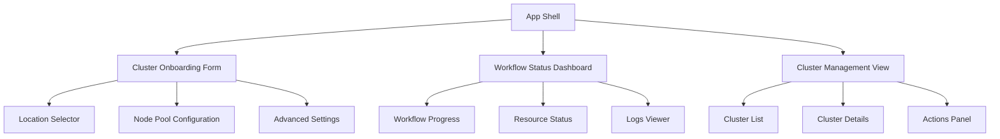
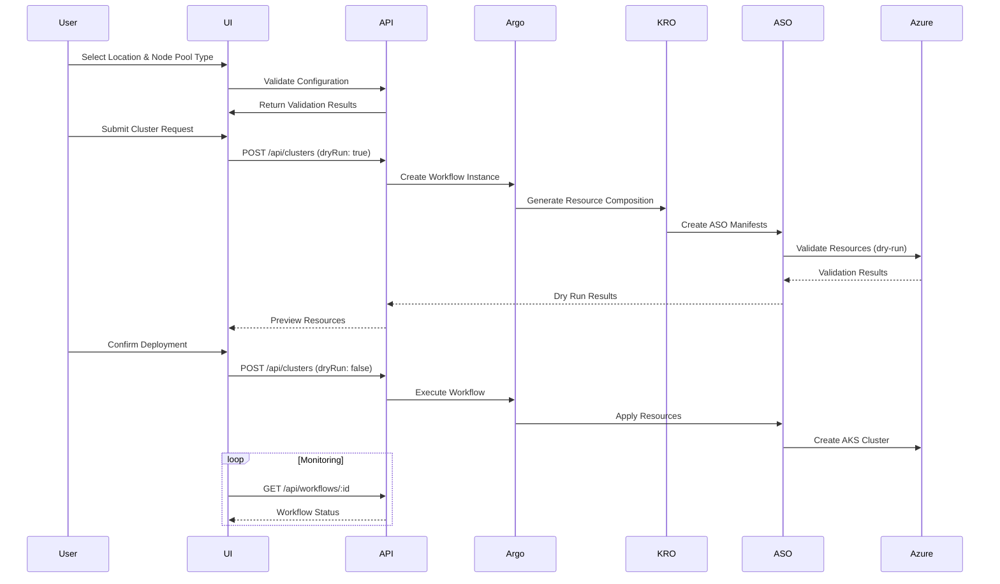

# Kubernetes Cluster Onboarding IDP Design

## Overview

This design outlines an Internal Developer Platform (IDP) similar to Backstage that provides a self-service UI for onboarding AKS clusters using modern cloud-native orchestration tools. The platform integrates Argo Workflows for orchestration, Kubernetes Resource Orchestrator (KRO) for resource composition, Azure Service Operator (ASO) for Azure resource management, and Node Auto Provisioning (NAP) for dynamic node scaling.

### Key Capabilities
- Self-service AKS cluster provisioning through a web interface
- Location and node pool type selection with NAP integration
- Workflow-driven infrastructure deployment using Argo Workflows
- Declarative resource composition via KRO
- Azure native resource management through ASO
- Dry-run capabilities for testing without Azure resource creation

## Technology Stack & Dependencies

### Core Platform Components
- **Frontend**: React-based UI similar to Backstage
- **Backend**: Node.js/Express API server
- **Orchestration**: Argo Workflows for cluster provisioning workflows
- **Resource Composition**: KRO for defining composite cluster resources
- **Azure Integration**: Azure Service Operator for managing Azure resources
- **Kubernetes**: Minikube for local development and testing

### Supporting Technologies
- **State Management**: Redux Toolkit for UI state management
- **API Client**: Axios for REST API communication
- **Validation**: Joi for input validation
- **UI Components**: Material-UI or Ant Design for consistent UX
- **Documentation**: Built-in help system and API documentation

## Component Architecture

### Frontend Application Structure



#### Component Definitions

**ClusterOnboardingForm**
- Primary user interface for cluster creation
- Handles location selection and node pool type configuration
- Integrates with NAP node provisioning options
- Provides validation and preview capabilities

```jsx
// Component props interface
interface ClusterOnboardingFormProps {
  onSubmit: (clusterConfig: ClusterConfiguration) => void;
  availableLocations: AzureLocation[];
  nodePoolTypes: NodePoolType[];
  isLoading: boolean;
}

// State management
const [formState, setFormState] = useState({
  location: '',
  nodePoolType: '',
  clusterName: '',
  dryRun: true
});
```

**WorkflowStatusDashboard**
- Real-time monitoring of Argo Workflow execution
- Displays workflow steps, status, and logs
- Provides abort and retry capabilities
- Shows Azure resource creation progress

**ClusterManagementView**
- Lists all provisioned clusters
- Displays cluster health and status
- Provides access to kubectl contexts
- Enables cluster lifecycle operations

### Component Hierarchy

```
├── App
│   ├── Header
│   │   ├── Navigation
│   │   └── UserProfile
│   ├── MainContent
│   │   ├── ClusterOnboardingForm
│   │   │   ├── LocationSelector
│   │   │   ├── NodePoolConfiguration
│   │   │   │   ├── NodePoolTypeSelector
│   │   │   │   ├── AutoScalingConfig
│   │   │   │   └── SecuritySettings
│   │   │   ├── AdvancedSettings
│   │   │   └── PreviewPanel
│   │   ├── WorkflowStatusDashboard
│   │   │   ├── WorkflowProgress
│   │   │   ├── ResourceStatusCards
│   │   │   └── LogsViewer
│   │   └── ClusterManagementView
│   │       ├── ClusterList
│   │       ├── ClusterDetails
│   │       └── ActionsPanel
│   └── Footer
```

### Props/State Management

The application uses Redux Toolkit for centralized state management with the following store structure:

```typescript
interface RootState {
  clusters: {
    list: Cluster[];
    current: Cluster | null;
    loading: boolean;
  };
  workflows: {
    active: Workflow[];
    history: Workflow[];
    logs: WorkflowLog[];
  };
  azure: {
    locations: AzureLocation[];
    nodePoolTypes: NodePoolType[];
    subscriptions: Subscription[];
  };
  ui: {
    activeView: 'onboarding' | 'dashboard' | 'management';
    notifications: Notification[];
  };
}
```

## Backend Architecture

### API Endpoints Reference

#### Cluster Management Endpoints

```typescript
// POST /api/clusters
interface CreateClusterRequest {
  name: string;
  location: string;
  nodePoolType: string;
  dryRun: boolean;
  advancedConfig?: AdvancedClusterConfig;
}

// GET /api/clusters
interface GetClustersResponse {
  clusters: ClusterSummary[];
  total: number;
}

// GET /api/clusters/:id
interface GetClusterResponse {
  cluster: ClusterDetails;
  workflow: WorkflowStatus;
  resources: AzureResourceStatus[];
}

// DELETE /api/clusters/:id
interface DeleteClusterRequest {
  force?: boolean;
  dryRun?: boolean;
}
```

#### Workflow Management Endpoints

```typescript
// GET /api/workflows/:id
interface GetWorkflowResponse {
  workflow: WorkflowDetails;
  steps: WorkflowStep[];
  logs: WorkflowLog[];
}

// POST /api/workflows/:id/abort
interface AbortWorkflowRequest {
  reason?: string;
}

// POST /api/workflows/:id/retry
interface RetryWorkflowRequest {
  fromStep?: string;
}
```

#### Azure Integration Endpoints

```typescript
// GET /api/azure/locations
interface GetLocationsResponse {
  locations: AzureLocation[];
}

// GET /api/azure/node-pool-types
interface GetNodePoolTypesResponse {
  nodePoolTypes: NodePoolType[];
  recommendations: NodePoolRecommendation[];
}
```

### Authentication Requirements

- **Service Principal Authentication**: For Azure resource management
- **Kubernetes RBAC**: For workflow and resource access control
- **API Key Authentication**: For frontend-backend communication
- **Azure RBAC**: For subscription and resource group permissions

### Data Models & Resource Definitions

#### Core Data Models

```typescript
interface Cluster {
  id: string;
  name: string;
  location: string;
  status: 'provisioning' | 'running' | 'failed' | 'deleting';
  kubernetesVersion: string;
  nodePool: NodePoolConfig;
  networking: NetworkConfig;
  security: SecurityConfig;
  createdAt: Date;
  updatedAt: Date;
  workflowId: string;
}

interface NodePoolConfig {
  type: string;
  minNodes: number;
  maxNodes: number;
  vmSize: string;
  enableAutoScaling: boolean;
  availabilityZones: string[];
  napEnabled: boolean;
}

interface WorkflowStatus {
  id: string;
  name: string;
  status: 'pending' | 'running' | 'succeeded' | 'failed' | 'error';
  startTime: Date;
  endTime?: Date;
  steps: WorkflowStep[];
  dryRun: boolean;
}
```

#### KRO Resource Compositions

```yaml
apiVersion: kro.run/v1alpha1
kind: ResourceGroup
metadata:
  name: aks-cluster-composition
spec:
  schema:
    openAPIV3Schema:
      type: object
      properties:
        spec:
          type: object
          properties:
            location:
              type: string
              enum: ["eastus", "westus2", "uksouth", "westeurope"]
            nodePoolType:
              type: string
              enum: ["standard", "memory-optimized", "compute-optimized"]
            enableNAP:
              type: boolean
              default: true
            dryRun:
              type: boolean
              default: false
  resources:
    - id: resource-group
      template:
        apiVersion: resources.azure.com/v1api20200601
        kind: ResourceGroup
        metadata:
          name: "rg-{{ .metadata.name }}"
        spec:
          location: "{{ .spec.location }}"
    - id: managed-cluster
      template:
        apiVersion: containerservice.azure.com/v1api20240402preview
        kind: ManagedCluster
        metadata:
          name: "{{ .metadata.name }}"
        spec:
          location: "{{ .spec.location }}"
          nodeProvisioningProfile:
            mode: "{{ if .spec.enableNAP }}Auto{{ else }}Manual{{ end }}"
```

## Argo Workflows Integration

### Cluster Provisioning Workflow

```yaml
apiVersion: argoproj.io/v1alpha1
kind: WorkflowTemplate
metadata:
  name: aks-cluster-onboarding
spec:
  entrypoint: provision-cluster
  arguments:
    parameters:
    - name: cluster-name
    - name: location
    - name: node-pool-type
    - name: dry-run
      value: "true"
  templates:
  - name: provision-cluster
    dag:
      tasks:
      - name: validate-inputs
        template: validate-cluster-config
      - name: create-kro-instance
        template: create-kro-cluster
        dependencies: [validate-inputs]
      - name: apply-aso-resources
        template: apply-aso-manifests
        dependencies: [create-kro-instance]
      - name: wait-for-cluster
        template: wait-cluster-ready
        dependencies: [apply-aso-resources]
        when: "{{workflow.parameters.dry-run}} == false"
      - name: configure-gitops
        template: setup-flux
        dependencies: [wait-for-cluster]
        when: "{{workflow.parameters.dry-run}} == false"

  - name: validate-cluster-config
    script:
      image: alpine/k8s:1.28.0
      command: [sh]
      source: |
        echo "Validating cluster configuration..."
        # Validation logic here
        
  - name: create-kro-cluster
    resource:
      action: create
      manifest: |
        apiVersion: kro.run/v1alpha1
        kind: AKSCluster
        metadata:
          name: "{{workflow.parameters.cluster-name}}"
        spec:
          location: "{{workflow.parameters.location}}"
          nodePoolType: "{{workflow.parameters.node-pool-type}}"
          dryRun: "{{workflow.parameters.dry-run}}"

  - name: apply-aso-manifests
    script:
      image: bitnami/kubectl:latest
      command: [sh]
      source: |
        echo "Applying ASO manifests..."
        if [ "{{workflow.parameters.dry-run}}" = "true" ]; then
          kubectl apply --dry-run=client -k ./aso-manifests
        else
          kubectl apply -k ./aso-manifests
        fi
```

### Workflow Status Monitoring

The platform provides real-time workflow monitoring through:

```typescript
// WebSocket connection for live updates
const workflowSubscription = {
  subscribe: (workflowId: string) => {
    return new WebSocket(`ws://api/workflows/${workflowId}/events`);
  },
  
  onStatusChange: (callback: (status: WorkflowStatus) => void) => {
    // Handle workflow status updates
  },
  
  onLogEntry: (callback: (log: WorkflowLog) => void) => {
    // Handle new log entries
  }
};
```

## NAP (Node Auto Provisioning) Integration

### Node Pool Configuration

The platform integrates with Azure Kubernetes Service Node Auto Provisioning to provide:

```typescript
interface NAPConfiguration {
  enabled: boolean;
  nodePoolTypes: {
    general: {
      vmSizes: string[];
      maxNodes: number;
      spotEnabled: boolean;
    };
    memoryOptimized: {
      vmSizes: string[];
      maxNodes: number;
      spotEnabled: boolean;
    };
    computeOptimized: {
      vmSizes: string[];
      maxNodes: number;
      spotEnabled: boolean;
    };
  };
  constraints: {
    maxTotalNodes: number;
    allowedZones: string[];
    taints: NodeTaint[];
  };
}
```

### UI Components for NAP

```jsx
const NodePoolSelector = () => {
  const [napConfig, setNapConfig] = useState({
    enabled: true,
    nodePoolType: 'general',
    constraints: {
      maxNodes: 10,
      enableSpot: false
    }
  });

  return (
    <Card>
      <CardHeader title="Node Auto Provisioning Configuration" />
      <CardContent>
        <FormControlLabel
          control={
            <Switch
              checked={napConfig.enabled}
              onChange={(e) => setNapConfig({
                ...napConfig,
                enabled: e.target.checked
              })}
            />
          }
          label="Enable Node Auto Provisioning"
        />
        
        <NodePoolTypeSelector
          value={napConfig.nodePoolType}
          onChange={(type) => setNapConfig({...napConfig, nodePoolType: type})}
          options={['general', 'memory-optimized', 'compute-optimized']}
        />
        
        <ConstraintsConfiguration
          constraints={napConfig.constraints}
          onChange={(constraints) => setNapConfig({...napConfig, constraints})}
        />
      </CardContent>
    </Card>
  );
};
```

## ASO (Azure Service Operator) Integration

### Resource Template Management

The platform manages ASO resource templates for different cluster configurations:

```yaml
# Base cluster template with NAP
apiVersion: containerservice.azure.com/v1api20240402preview
kind: ManagedCluster
metadata:
  name: "{{ .clusterName }}"
  namespace: azure-system
spec:
  location: "{{ .location }}"
  nodeProvisioningProfile:
    mode: Auto
  agentPoolProfiles:
  - name: systempool
    mode: System
    count: 1
    vmSize: "{{ .nodePoolConfig.systemVmSize }}"
    enableAutoScaling: true
    minCount: 1
    maxCount: 3
  networkProfile:
    networkPlugin: azure
    networkPluginMode: overlay
    networkPolicy: cilium
  securityProfile:
    workloadIdentity:
      enabled: true
  autoUpgradeProfile:
    upgradeChannel: stable
```

### Dry Run Implementation

For testing without Azure resource creation:

```typescript
class ASOResourceManager {
  async applyResources(manifests: KubernetesManifest[], dryRun: boolean) {
    if (dryRun) {
      // Validate manifests and return simulated results
      return this.simulateResourceCreation(manifests);
    } else {
      // Apply actual resources to Azure
      return this.createAzureResources(manifests);
    }
  }
  
  private async simulateResourceCreation(manifests: KubernetesManifest[]) {
    // Mock Azure resource creation for testing
    return {
      status: 'success',
      resources: manifests.map(manifest => ({
        kind: manifest.kind,
        name: manifest.metadata.name,
        status: 'simulated-success',
        armId: `simulated-arm-id-${manifest.metadata.name}`
      }))
    };
  }
}
```

## User Interface Design

### Cluster Onboarding Flow



### Location Selector Component

```jsx
const LocationSelector = ({ value, onChange, availableLocations }) => {
  const [recommendations, setRecommendations] = useState([]);
  
  useEffect(() => {
    // Fetch location recommendations based on user context
    fetchLocationRecommendations().then(setRecommendations);
  }, []);
  
  return (
    <FormControl fullWidth>
      <InputLabel>Azure Region</InputLabel>
      <Select value={value} onChange={onChange}>
        <ListSubheader>Recommended</ListSubheader>
        {recommendations.map(location => (
          <MenuItem key={location.name} value={location.name}>
            <LocationItem location={location} isRecommended />
          </MenuItem>
        ))}
        
        <ListSubheader>All Regions</ListSubheader>
        {availableLocations.map(location => (
          <MenuItem key={location.name} value={location.name}>
            <LocationItem location={location} />
          </MenuItem>
        ))}
      </Select>
    </FormControl>
  );
};
```

### Workflow Progress Visualization

```jsx
const WorkflowProgress = ({ workflow }) => {
  return (
    <Card>
      <CardHeader 
        title={`Cluster: ${workflow.clusterName}`}
        subheader={`Status: ${workflow.status}`}
      />
      <CardContent>
        <Stepper activeStep={workflow.currentStep} orientation="vertical">
          {workflow.steps.map((step, index) => (
            <Step key={step.name}>
              <StepLabel 
                error={step.status === 'failed'}
                completed={step.status === 'completed'}
              >
                {step.displayName}
              </StepLabel>
              <StepContent>
                <Typography variant="body2">
                  {step.description}
                </Typography>
                {step.logs && (
                  <Accordion>
                    <AccordionSummary>View Logs</AccordionSummary>
                    <AccordionDetails>
                      <LogViewer logs={step.logs} />
                    </AccordionDetails>
                  </Accordion>
                )}
              </StepContent>
            </Step>
          ))}
        </Stepper>
      </CardContent>
    </Card>
  );
};
```

## Testing Strategy

### Unit Testing Framework

```typescript
// Frontend component testing with React Testing Library
describe('ClusterOnboardingForm', () => {
  it('validates required fields before submission', async () => {
    render(<ClusterOnboardingForm onSubmit={jest.fn()} />);
    
    const submitButton = screen.getByText('Create Cluster');
    fireEvent.click(submitButton);
    
    expect(screen.getByText('Location is required')).toBeInTheDocument();
    expect(screen.getByText('Node pool type is required')).toBeInTheDocument();
  });
  
  it('enables dry run by default', () => {
    render(<ClusterOnboardingForm onSubmit={jest.fn()} />);
    
    const dryRunSwitch = screen.getByLabelText('Dry Run Mode');
    expect(dryRunSwitch).toBeChecked();
  });
});

// Backend API testing
describe('Cluster API', () => {
  it('creates workflow for cluster provisioning', async () => {
    const mockWorkflow = { id: 'wf-123', status: 'pending' };
    jest.spyOn(argoClient, 'createWorkflow').mockResolvedValue(mockWorkflow);
    
    const response = await request(app)
      .post('/api/clusters')
      .send({
        name: 'test-cluster',
        location: 'eastus',
        nodePoolType: 'standard',
        dryRun: true
      });
    
    expect(response.status).toBe(201);
    expect(response.body.workflowId).toBe('wf-123');
  });
});
```

### Integration Testing with Minikube

```bash
#!/bin/bash
# integration-test.sh - Test workflow execution on Minikube

echo "Setting up test environment..."
minikube start --driver=docker --memory=4g --cpus=2

echo "Installing required operators..."
kubectl apply -f https://github.com/Azure/azure-service-operator/releases/latest/download/azureserviceoperator_v2.9.0_linux_amd64.yaml
kubectl apply -n argo -f https://github.com/argoproj/argo-workflows/releases/download/v3.5.2/install.yaml

echo "Running dry-run cluster creation test..."
kubectl apply -f test/fixtures/test-cluster-dryrun.yaml

echo "Verifying workflow execution..."
kubectl wait --for=condition=Completed workflow/test-cluster-workflow --timeout=300s

echo "Checking ASO resource validation..."
kubectl get managedcluster test-cluster -o yaml | grep "dryRun: true"

echo "Test completed successfully!"
```

### Workflow Testing Patterns

```yaml
# Test workflow template for validation
apiVersion: argoproj.io/v1alpha1
kind: Workflow
metadata:
  name: test-cluster-validation
spec:
  entrypoint: test-cluster-provisioning
  arguments:
    parameters:
    - name: test-cluster-name
      value: "test-cluster-{{ randAlphaNum 5 | lower }}"
    - name: location
      value: "eastus"
    - name: dry-run
      value: "true"
  templates:
  - name: test-cluster-provisioning
    steps:
    - - name: validate-config
        template: validate-inputs
    - - name: dry-run-resources
        template: create-aso-resources
    - - name: verify-output
        template: check-resource-status

  - name: validate-inputs
    script:
      image: alpine/k8s:1.28.0
      command: [sh]
      source: |
        echo "Testing input validation..."
        if [ -z "{{workflow.parameters.test-cluster-name}}" ]; then
          echo "Cluster name is required"
          exit 1
        fi
        echo "Validation passed"

  - name: create-aso-resources
    resource:
      action: create
      flags: ["--dry-run=client"]
      manifest: |
        apiVersion: containerservice.azure.com/v1api20240402preview
        kind: ManagedCluster
        metadata:
          name: "{{workflow.parameters.test-cluster-name}}"
        spec:
          location: "{{workflow.parameters.location}}"
          nodeProvisioningProfile:
            mode: Auto

  - name: check-resource-status
    script:
      image: bitnami/kubectl:latest
      command: [sh]
      source: |
        echo "Verifying dry-run completed successfully"
        kubectl get managedcluster "{{workflow.parameters.test-cluster-name}}" -o jsonpath='{.metadata.name}'
```