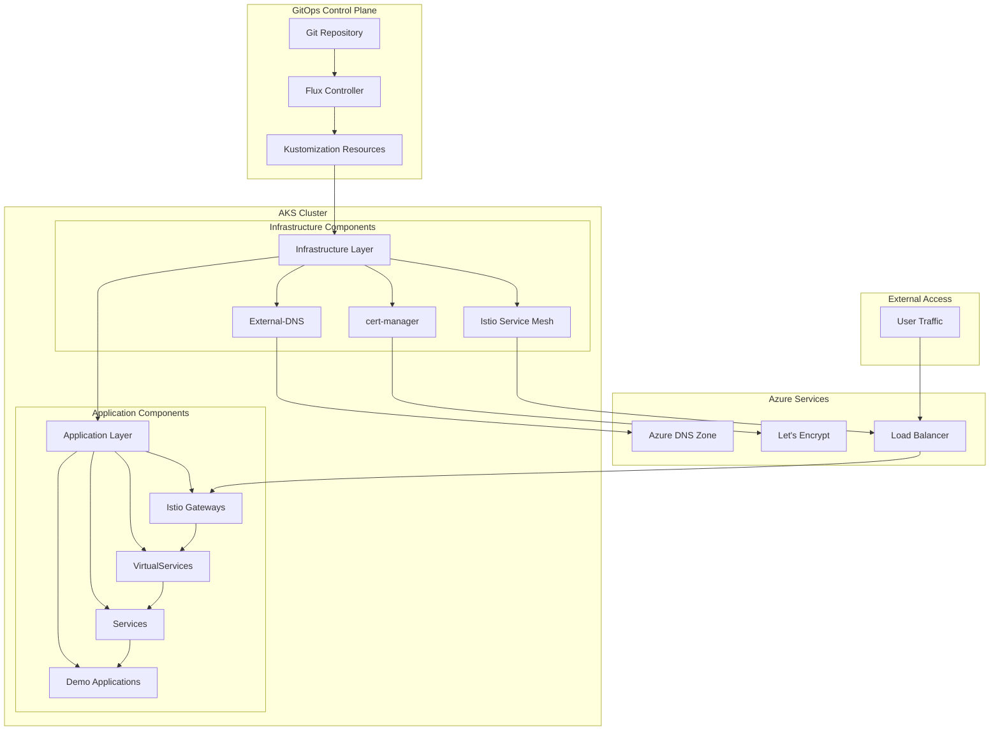
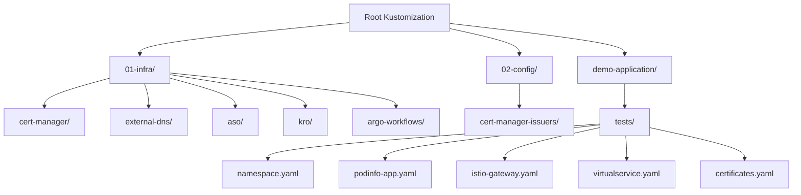
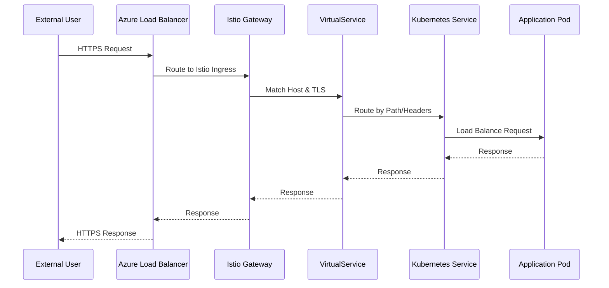
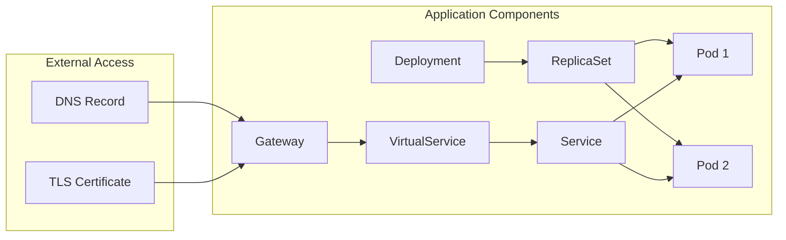
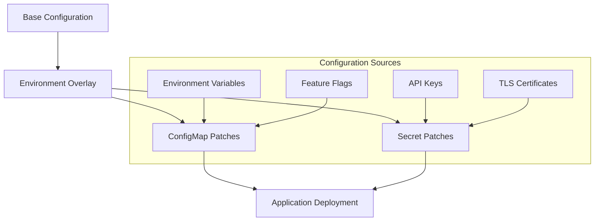
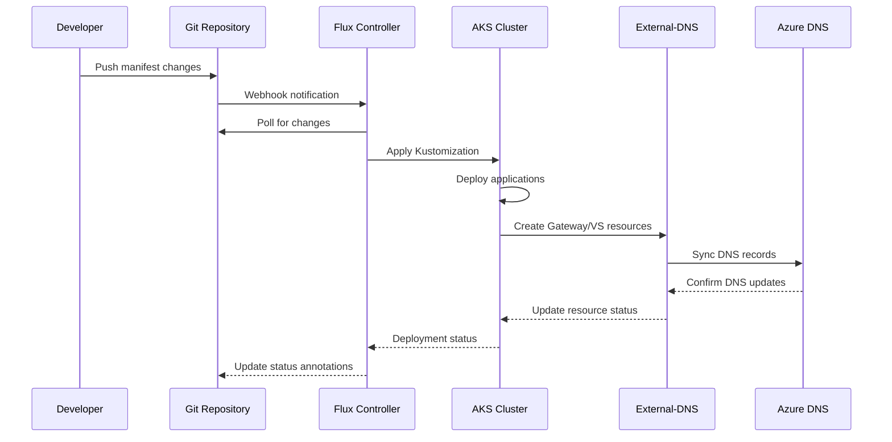
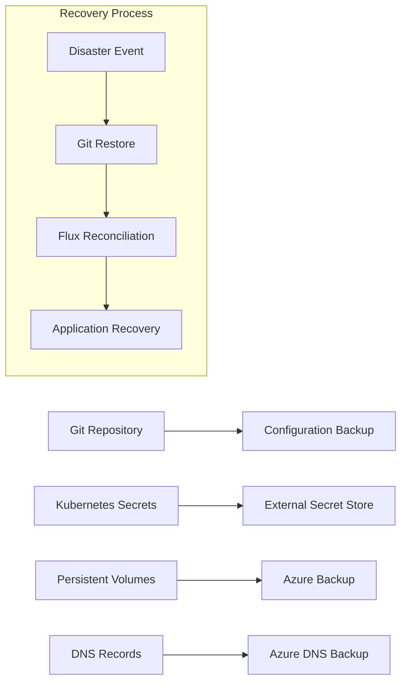

# Kustomize AKS Deployment Design

## Overview

This design outlines a comprehensive strategy for deploying demo applications to Azure Kubernetes Service (AKS) clusters using Kustomize, with integrated DNS management and traffic routing through Istio service mesh. The solution leverages GitOps principles with Flux for continuous deployment and External-DNS for automated DNS record management.

## Technology Stack & Dependencies

### Core Technologies
- **Kubernetes**: Container orchestration platform (AKS)
- **Kustomize**: Native Kubernetes configuration management
- **Flux**: GitOps operator for continuous deployment
- **Istio Service Mesh**: Traffic management and ingress routing
- **External-DNS**: Automated DNS record synchronization
- **cert-manager**: TLS certificate lifecycle management

### Azure Services Integration
- **Azure Kubernetes Service (AKS)**: Managed Kubernetes platform
- **Azure DNS**: Cloud DNS service for domain management
- **Azure Workload Identity**: Secure authentication for cluster workloads

## Architecture

### Deployment Architecture Overview



### Layered Deployment Strategy

The deployment follows a hierarchical layering approach:

1. **Infrastructure Layer (01-infra/)**: Core platform services
2. **Configuration Layer (02-config/)**: Cross-cutting configuration
3. **Application Layer**: Demo applications and workloads

### Kustomization Structure



## DNS Management & Traffic Routing

### DNS Automation Strategy

External-DNS automatically manages DNS records based on Kubernetes resource annotations:

#### DNS Record Sources
- **Gateway Resources**: Create DNS entries for ingress endpoints
- **VirtualService Resources**: Define hostname-to-service mappings
- **Service Resources**: Direct service exposure (optional)

#### Annotation-Based DNS Control

```yaml
metadata:
  annotations:
    external-dns.alpha.kubernetes.io/hostname: "app.test.davidmarkgardiner.co.uk"
    external-dns.alpha.kubernetes.io/ttl: "300"
```

### Traffic Routing Architecture

#### Istio Gateway Configuration



#### Multi-Gateway Strategy

| Gateway Type | Purpose | Selector | Use Case |
|--------------|---------|----------|----------|
| External Gateway | Public internet access | `aks-istio-ingressgateway-external` | Production services |
| Internal Gateway | Private cluster access | `aks-istio-ingressgateway-internal` | Testing/staging |

### TLS Certificate Management

#### Wildcard Certificate Strategy

```yaml
apiVersion: cert-manager.io/v1
kind: Certificate
metadata:
  name: test-wildcard-tls-cert
  namespace: test-dns
spec:
  secretName: test-wildcard-tls-cert
  issuerRef:
    name: letsencrypt-prod-dns01
    kind: ClusterIssuer
  dnsNames:
  - "*.test.davidmarkgardiner.co.uk"
  - test.davidmarkgardiner.co.uk
```

#### Certificate Distribution Strategy

Certificates are provisioned in multiple namespaces for cross-namespace access:
- Application namespace (e.g., `test-dns`)
- Istio system namespace (`aks-istio-system`)

## Demo Application Deployment

### Application Specification

#### Podinfo Demo Application



#### Resource Configuration

| Resource Type | Configuration | Purpose |
|---------------|---------------|---------|
| **Deployment** | 2 replicas, resource limits | Application runtime |
| **Service** | ClusterIP, port 9898 | Internal load balancing |
| **VirtualService** | Host routing, path matching | Traffic routing rules |
| **Gateway** | TLS termination, host binding | Ingress configuration |

### Health Monitoring Strategy

#### Probe Configuration

```yaml
livenessProbe:
  httpGet:
    path: /healthz
    port: 9898
  initialDelaySeconds: 5
  periodSeconds: 10

readinessProbe:
  httpGet:
    path: /readyz
    port: 9898
  initialDelaySeconds: 5
  periodSeconds: 5
```

#### Monitoring Integration

- **Health Endpoints**: `/healthz`, `/readyz`
- **Metrics Endpoint**: `/metrics` (Prometheus format)
- **Resource Monitoring**: CPU/Memory limits and requests

## Kustomization Implementation

### Base Configuration Structure

```yaml
# kustomization.yaml
apiVersion: kustomize.config.k8s.io/v1beta1
kind: Kustomization

metadata:
  name: demo-applications
  annotations:
    config.kubernetes.io/local-config: "true"
    platform.io/description: "Demo applications for AKS deployment testing"

resources:
  - namespace.yaml
  - podinfo-app.yaml
  - istio-gateway.yaml
  - virtualservice.yaml
  - certificates.yaml

labels:
- pairs:
    app.kubernetes.io/component: demo-applications
    platform.io/layer: "04-applications"
    managed-by: flux
```

### Environment-Specific Overlays

#### Development Environment

```yaml
# overlays/dev/kustomization.yaml
apiVersion: kustomize.config.k8s.io/v1beta1
kind: Kustomization

resources:
  - ../../base

patchesStrategicMerge:
  - replica-count.yaml
  - resource-limits.yaml

namespace: demo-dev
```

#### Production Environment

```yaml
# overlays/prod/kustomization.yaml
apiVersion: kustomize.config.k8s.io/v1beta1
kind: Kustomization

resources:
  - ../../base

patchesStrategicMerge:
  - production-config.yaml
  - security-policy.yaml

namespace: demo-prod
```

### Configuration Management Patterns

#### ConfigMap and Secret Management



## Network Security & Access Control

### Istio Security Policies

#### Authorization Policy Example

```yaml
apiVersion: security.istio.io/v1beta1
kind: AuthorizationPolicy
metadata:
  name: demo-app-policy
  namespace: test-dns
spec:
  selector:
    matchLabels:
      app: podinfo
  rules:
  - from:
    - source:
        principals: ["cluster.local/ns/istio-system/sa/istio-ingressgateway-external"]
  - to:
    - operation:
        methods: ["GET", "POST"]
        paths: ["/", "/healthz", "/readyz", "/metrics"]
```

#### Network Policy Integration

```yaml
apiVersion: networking.k8s.io/v1
kind: NetworkPolicy
metadata:
  name: demo-app-netpol
  namespace: test-dns
spec:
  podSelector:
    matchLabels:
      app: podinfo
  policyTypes:
  - Ingress
  - Egress
  ingress:
  - from:
    - namespaceSelector:
        matchLabels:
          name: aks-istio-system
    ports:
    - protocol: TCP
      port: 9898
```

## Deployment Workflow

### GitOps Deployment Process



### Deployment Validation Strategy

#### Pre-deployment Validation

```bash
# Kustomization validation
kustomize build 01-infra/demo-application/tests

# Dry-run deployment
kubectl apply --dry-run=server -k 01-infra/demo-application/tests

# Resource validation
kubectl wait --for=condition=Ready pods -l app=podinfo -n test-dns --timeout=300s
```

#### Post-deployment Testing

```bash
# Connectivity testing
curl -k https://podinfo.test.davidmarkgardiner.co.uk/healthz

# DNS resolution verification
nslookup podinfo.test.davidmarkgardiner.co.uk

# Certificate validation
openssl s_client -connect podinfo.test.davidmarkgardiner.co.uk:443 -servername podinfo.test.davidmarkgardiner.co.uk
```

## Operational Considerations

### Monitoring and Observability

#### Key Metrics

| Metric Category | Metrics | Purpose |
|-----------------|---------|---------|
| **Application** | Request rate, latency, errors | Application performance |
| **Infrastructure** | Pod status, resource usage | Resource management |
| **Network** | DNS resolution time, TLS handshake | Network performance |
| **Security** | Certificate expiry, policy violations | Security posture |

#### Logging Strategy

```yaml
# Fluent Bit configuration for demo apps
apiVersion: v1
kind: ConfigMap
metadata:
  name: fluent-bit-config
  namespace: test-dns
data:
  fluent-bit.conf: |
    [SERVICE]
        Flush         1
        Log_Level     info
        Daemon        off
        HTTP_Server   On
        HTTP_Listen   0.0.0.0
        HTTP_Port     2020
    
    [INPUT]
        Name              tail
        Path              /var/log/containers/podinfo*.log
        Parser            docker
        Tag               demo.podinfo
        Refresh_Interval  5
```

### Backup and Recovery

#### Configuration Backup Strategy



#### Recovery Procedures

1. **Configuration Recovery**: Git-based restore via Flux
2. **Certificate Recovery**: Automatic re-issuance via cert-manager
3. **DNS Recovery**: Automatic synchronization via External-DNS
4. **Application Data**: Azure-native backup solutions

### Scaling Considerations

#### Horizontal Pod Autoscaling

```yaml
apiVersion: autoscaling/v2
kind: HorizontalPodAutoscaler
metadata:
  name: podinfo-hpa
  namespace: test-dns
spec:
  scaleTargetRef:
    apiVersion: apps/v1
    kind: Deployment
    name: podinfo
  minReplicas: 2
  maxReplicas: 10
  metrics:
  - type: Resource
    resource:
      name: cpu
      target:
        type: Utilization
        averageUtilization: 70
  - type: Resource
    resource:
      name: memory
      target:
        type: Utilization
        averageUtilization: 80
```

#### Cluster Autoscaling Integration

- **Node Auto Provisioning (NAP)**: Automatic node scaling based on workload requirements
- **Vertical Pod Autoscaling**: Automatic resource recommendation and adjustment
- **Cluster Proportional Autoscaling**: DNS and logging component scaling

## Testing Strategy

### Unit Testing

#### Kustomization Testing

```bash
#!/bin/bash
# test-kustomization.sh

set -e

echo "Testing kustomization build..."
kustomize build 01-infra/demo-application/tests > /tmp/demo-app-manifests.yaml

echo "Validating generated manifests..."
kubectl apply --dry-run=client -f /tmp/demo-app-manifests.yaml

echo "Testing specific resource generation..."
grep -q "kind: Gateway" /tmp/demo-app-manifests.yaml
grep -q "kind: VirtualService" /tmp/demo-app-manifests.yaml
grep -q "kind: Certificate" /tmp/demo-app-manifests.yaml

echo "All tests passed!"
```

#### Resource Validation Testing

```yaml
# test-suite.yaml
apiVersion: v1
kind: ConfigMap
metadata:
  name: validation-tests
  namespace: test-dns
data:
  test-dns-resolution.sh: |
    #!/bin/bash
    dig +short podinfo.test.davidmarkgardiner.co.uk
    
  test-tls-certificate.sh: |
    #!/bin/bash
    echo | openssl s_client -connect podinfo.test.davidmarkgardiner.co.uk:443 -servername podinfo.test.davidmarkgardiner.co.uk 2>/dev/null | openssl x509 -noout -dates
    
  test-application-health.sh: |
    #!/bin/bash
    curl -f https://podinfo.test.davidmarkgardiner.co.uk/healthz
```