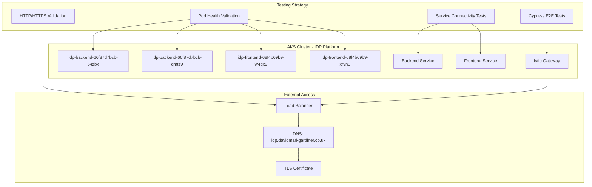
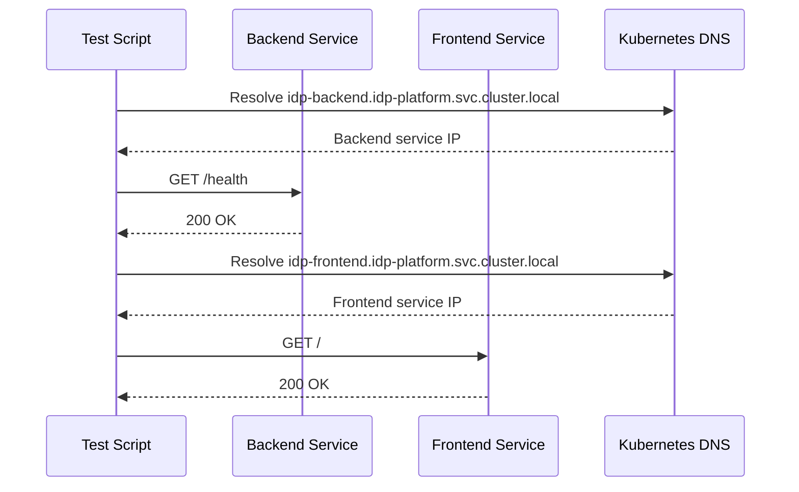
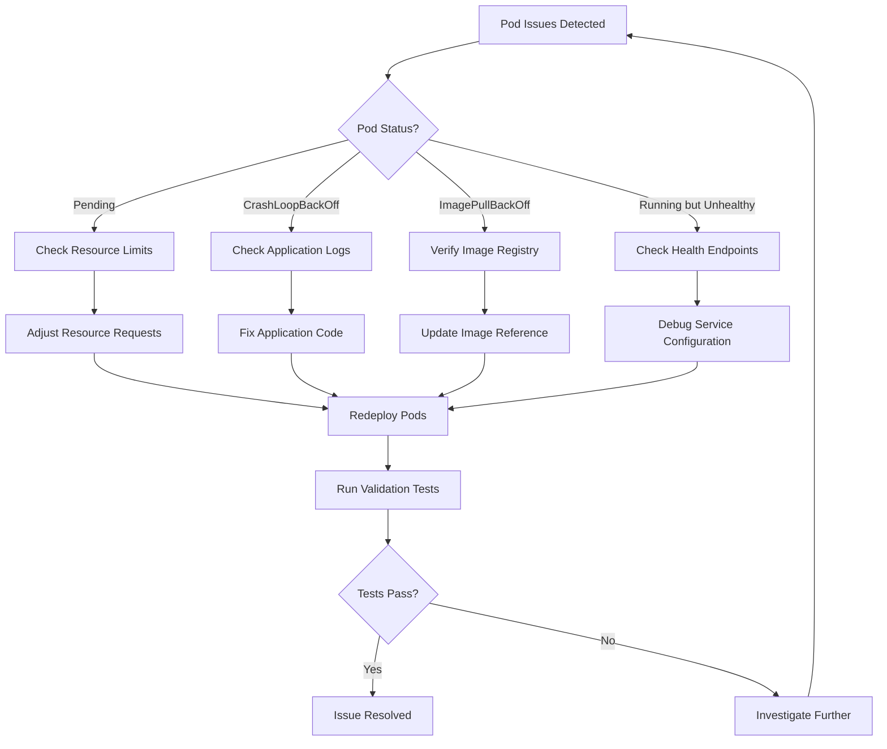

# Test and Fix Deployment Issues for IDP Pods in AKS

## Overview

This design outlines a comprehensive testing and validation strategy for the IDP (Internal Developer Platform) pods running in Azure Kubernetes Service (AKS). The focus is on validating the health, connectivity, and functionality of the `idp-backend` and `idp-frontend` pods, leveraging Cypress E2E testing framework and Kubernetes validation tools to identify and resolve deployment issues.

Current pod status shows 4 running pods:
- 2x `idp-backend` pods (Running)
- 2x `idp-frontend` pods (Running)

## Technology Stack & Dependencies

### Core Infrastructure
- **Azure Kubernetes Service (AKS)**: Production container orchestration
- **Node.js Backend**: Express.js API server with health endpoints
- **React Frontend**: Single-page application with nginx reverse proxy
- **Istio Service Mesh**: Traffic management and TLS termination
- **Cert-Manager**: TLS certificate automation
- **External-DNS**: Automated DNS record management

### Testing Framework
- **Cypress**: End-to-end testing for UI and API validation
- **kubectl**: Kubernetes cluster operations and validation
- **curl**: HTTP/HTTPS connectivity testing
- **Azure CLI**: Cloud resource validation

## Architecture



## Component Architecture

### 1. Pod Health Validation

#### Backend Pod Validation
```yaml
apiVersion: v1
kind: ConfigMap
metadata:
  name: backend-validation-config
  namespace: idp-platform
data:
  validate-backend.sh: |
    #!/bin/bash
    set -euo pipefail
    
    echo "=== IDP Backend Pod Validation ==="
    
    # Check pod status
    kubectl get pods -n idp-platform -l app=idp-backend --no-headers | while read line; do
      POD_NAME=$(echo $line | awk '{print $1}')
      POD_STATUS=$(echo $line | awk '{print $3}')
      READY=$(echo $line | awk '{print $2}')
      
      echo "Pod: $POD_NAME - Status: $POD_STATUS - Ready: $READY"
      
      if [ "$POD_STATUS" != "Running" ]; then
        echo "ERROR: Pod $POD_NAME is not running"
        kubectl describe pod $POD_NAME -n idp-platform
        kubectl logs $POD_NAME -n idp-platform --tail=50
        return 1
      fi
      
      # Test health endpoint
      kubectl exec $POD_NAME -n idp-platform -- curl -f http://localhost:3001/health || {
        echo "ERROR: Health check failed for $POD_NAME"
        return 1
      }
      
      echo "✓ Pod $POD_NAME is healthy"
    done
```

#### Frontend Pod Validation
```yaml
apiVersion: v1
kind: ConfigMap
metadata:
  name: frontend-validation-config
  namespace: idp-platform
data:
  validate-frontend.sh: |
    #!/bin/bash
    set -euo pipefail
    
    echo "=== IDP Frontend Pod Validation ==="
    
    # Check pod status
    kubectl get pods -n idp-platform -l app=idp-frontend --no-headers | while read line; do
      POD_NAME=$(echo $line | awk '{print $1}')
      POD_STATUS=$(echo $line | awk '{print $3}')
      READY=$(echo $line | awk '{print $2}')
      
      echo "Pod: $POD_NAME - Status: $POD_STATUS - Ready: $READY"
      
      if [ "$POD_STATUS" != "Running" ]; then
        echo "ERROR: Pod $POD_NAME is not running"
        kubectl describe pod $POD_NAME -n idp-platform
        kubectl logs $POD_NAME -n idp-platform --tail=50
        return 1
      fi
      
      # Test nginx health
      kubectl exec $POD_NAME -n idp-platform -- curl -f http://localhost:80/ || {
        echo "ERROR: Frontend health check failed for $POD_NAME"
        return 1
      }
      
      echo "✓ Pod $POD_NAME is serving content"
    done
```

### 2. Service Connectivity Testing

#### Internal Service Discovery


#### Service Endpoint Validation
```bash
#!/bin/bash
# Service connectivity validation script

validate_backend_service() {
    echo "Testing backend service connectivity..."
    
    # Test internal service discovery
    kubectl run test-pod --rm -i --restart=Never --image=curlimages/curl -- \
        curl -f http://idp-backend.idp-platform.svc.cluster.local:3001/health
    
    # Test service endpoints
    BACKEND_ENDPOINTS=$(kubectl get endpoints idp-backend -n idp-platform -o jsonpath='{.subsets[*].addresses[*].ip}')
    for ip in $BACKEND_ENDPOINTS; do
        kubectl run test-pod --rm -i --restart=Never --image=curlimages/curl -- \
            curl -f http://$ip:3001/health
    done
}

validate_frontend_service() {
    echo "Testing frontend service connectivity..."
    
    # Test internal service discovery
    kubectl run test-pod --rm -i --restart=Never --image=curlimages/curl -- \
        curl -f http://idp-frontend.idp-platform.svc.cluster.local:80/
    
    # Test service endpoints
    FRONTEND_ENDPOINTS=$(kubectl get endpoints idp-frontend -n idp-platform -o jsonpath='{.subsets[*].addresses[*].ip}')
    for ip in $FRONTEND_ENDPOINTS; do
        kubectl run test-pod --rm -i --restart=Never --image=curlimages/curl -- \
            curl -f http://$ip:80/
    done
}
```

### 3. Cypress E2E Testing Strategy

#### Smoke Tests for IDP Pods
```javascript
describe('IDP Pod Health Validation', { tags: ['@idp-health'] }, () => {
  const apiUrl = Cypress.env('apiUrl') || 'http://idp-backend.idp-platform.svc.cluster.local:3001'
  const frontendUrl = Cypress.env('frontendUrl') || 'http://idp-frontend.idp-platform.svc.cluster.local:80'
  
  beforeEach(() => {
    // Set up API interceptions for mocking
    cy.intercept('GET', '**/health', { 
      status: 'healthy', 
      timestamp: new Date().toISOString(),
      version: '1.0.0'
    }).as('healthCheck')
  })

  it('should validate backend pod health endpoints', () => {
    // Test health endpoint directly
    cy.request({
      method: 'GET',
      url: `${apiUrl}/health`,
      timeout: 10000
    }).then((response) => {
      expect(response.status).to.eq(200)
      expect(response.body).to.have.property('status', 'healthy')
      expect(response.body).to.have.property('timestamp')
    })
  })

  it('should validate backend API endpoints', () => {
    // Test clusters endpoint
    cy.request({
      method: 'GET',
      url: `${apiUrl}/api/clusters`,
      timeout: 10000
    }).then((response) => {
      expect(response.status).to.eq(200)
      expect(response.body).to.be.an('object')
    })

    // Test workflows endpoint
    cy.request({
      method: 'GET',
      url: `${apiUrl}/api/workflows`,
      timeout: 10000
    }).then((response) => {
      expect(response.status).to.eq(200)
      expect(response.body).to.be.an('object')
    })
  })

  it('should validate frontend pod serving content', () => {
    // Test frontend root endpoint
    cy.request({
      method: 'GET',
      url: frontendUrl,
      timeout: 10000
    }).then((response) => {
      expect(response.status).to.eq(200)
      expect(response.body).to.include('<!DOCTYPE html>')
    })
  })

  it('should test load balancing across backend pods', () => {
    // Make multiple requests to test load balancing
    const requests = Array.from({ length: 10 }, (_, i) => 
      cy.request({
        method: 'GET',
        url: `${apiUrl}/health`,
        timeout: 5000
      })
    )

    Promise.all(requests).then((responses) => {
      responses.forEach((response) => {
        expect(response.status).to.eq(200)
      })
    })
  })

  it('should validate pod resource utilization', () => {
    cy.task('validatePodResources', {
      namespace: 'idp-platform',
      labels: 'app=idp-backend'
    }).then((result) => {
      expect(result.success).to.be.true
      expect(result.pods).to.have.length.greaterThan(0)
    })

    cy.task('validatePodResources', {
      namespace: 'idp-platform',
      labels: 'app=idp-frontend'
    }).then((result) => {
      expect(result.success).to.be.true
      expect(result.pods).to.have.length.greaterThan(0)
    })
  })
})
```

#### Production Integration Tests
```javascript
describe('IDP End-to-End Integration', { tags: ['@idp-integration'] }, () => {
  const baseUrl = 'https://idp.davidmarkgardiner.co.uk'
  
  beforeEach(() => {
    cy.visit(baseUrl)
    cy.wait(2000) // Allow for component mounting
  })

  it('should load the IDP application successfully', () => {
    // Verify main application loads
    cy.contains('AKS Internal Developer Platform').should('be.visible')
    cy.contains('AKS Cluster Onboarding').should('be.visible')
    
    // Verify no JavaScript errors
    cy.window().then((win) => {
      expect(win.console.error).to.not.have.been.called
    })
  })

  it('should validate API connectivity through ingress', () => {
    // Test API endpoints through external ingress
    cy.request({
      method: 'GET',
      url: `${baseUrl}/api/health`,
      timeout: 15000
    }).then((response) => {
      expect(response.status).to.eq(200)
      expect(response.body).to.have.property('status', 'healthy')
    })
  })

  it('should test cluster onboarding workflow', () => {
    // Navigate to onboarding page
    cy.get('[data-testid="nav-onboarding"]').click()
    
    // Fill out cluster creation form
    cy.get('[data-testid="cluster-name-input"] input').type('cypress-test-cluster')
    cy.get('[data-testid="location-select"]').click()
    cy.get('[data-value="uksouth"]').click()
    cy.get('[data-testid="node-pool-type-select"]').click()
    cy.get('[data-value="standard"]').click()
    
    // Enable dry-run mode
    cy.get('[data-testid="dry-run-switch"] input').should('be.checked')
    
    // Submit form (dry-run)
    cy.get('[data-testid="submit-cluster-button"]').click()
    
    // Verify workflow initiation
    cy.contains('Workflow started').should('be.visible')
  })
})
```

### 4. Infrastructure Validation Scripts

#### Complete IDP Validation Script
```bash
#!/bin/bash
set -euo pipefail

# IDP Pod Deployment Validation Script for AKS
echo "=== IDP Platform Deployment Validation ==="

# Configuration
NAMESPACE="idp-platform"
DOMAIN="idp.davidmarkgardiner.co.uk"

# Colors for output
RED='\033[0;31m'
GREEN='\033[0;32m'
YELLOW='\033[1;33m'
NC='\033[0m'

function print_status() {
    if [ $1 -eq 0 ]; then
        echo -e "${GREEN}✓${NC} $2"
    else
        echo -e "${RED}✗${NC} $2"
    fi
}

function print_warning() {
    echo -e "${YELLOW}⚠${NC} $1"
}

# 1. Cluster connectivity
echo "1. Checking AKS cluster connectivity..."
if kubectl cluster-info &>/dev/null; then
    print_status 0 "Connected to AKS cluster"
    CONTEXT=$(kubectl config current-context)
    echo "   Context: $CONTEXT"
else
    print_status 1 "Failed to connect to cluster"
    exit 1
fi

# 2. Namespace validation
echo -e "\n2. Checking namespace and RBAC..."
if kubectl get namespace $NAMESPACE &>/dev/null; then
    print_status 0 "Namespace $NAMESPACE exists"
else
    print_status 1 "Namespace $NAMESPACE not found"
fi

# 3. Pod status validation
echo -e "\n3. Validating IDP pod status..."
BACKEND_PODS=$(kubectl get pods -n $NAMESPACE -l app=idp-backend --no-headers | wc -l)
FRONTEND_PODS=$(kubectl get pods -n $NAMESPACE -l app=idp-frontend --no-headers | wc -l)

print_status 0 "Found $BACKEND_PODS backend pods and $FRONTEND_PODS frontend pods"

# Check individual pod health
kubectl get pods -n $NAMESPACE -l app=idp-backend --no-headers | while read line; do
    POD_NAME=$(echo $line | awk '{print $1}')
    POD_STATUS=$(echo $line | awk '{print $3}')
    READY=$(echo $line | awk '{print $2}')
    
    if [ "$POD_STATUS" = "Running" ] && [ "$READY" = "1/1" ]; then
        print_status 0 "Backend pod $POD_NAME is healthy"
    else
        print_status 1 "Backend pod $POD_NAME has issues (Status: $POD_STATUS, Ready: $READY)"
        kubectl describe pod $POD_NAME -n $NAMESPACE
    fi
done

kubectl get pods -n $NAMESPACE -l app=idp-frontend --no-headers | while read line; do
    POD_NAME=$(echo $line | awk '{print $1}')
    POD_STATUS=$(echo $line | awk '{print $3}')
    READY=$(echo $line | awk '{print $2}')
    
    if [ "$POD_STATUS" = "Running" ] && [ "$READY" = "1/1" ]; then
        print_status 0 "Frontend pod $POD_NAME is healthy"
    else
        print_status 1 "Frontend pod $POD_NAME has issues (Status: $POD_STATUS, Ready: $READY)"
        kubectl describe pod $POD_NAME -n $NAMESPACE
    fi
done

# 4. Service validation
echo -e "\n4. Checking service configurations..."
if kubectl get service idp-backend -n $NAMESPACE &>/dev/null; then
    BACKEND_ENDPOINTS=$(kubectl get endpoints idp-backend -n $NAMESPACE -o jsonpath='{.subsets[*].addresses[*].ip}' | wc -w)
    print_status 0 "Backend service has $BACKEND_ENDPOINTS endpoints"
else
    print_status 1 "Backend service not found"
fi

if kubectl get service idp-frontend -n $NAMESPACE &>/dev/null; then
    FRONTEND_ENDPOINTS=$(kubectl get endpoints idp-frontend -n $NAMESPACE -o jsonpath='{.subsets[*].addresses[*].ip}' | wc -w)
    print_status 0 "Frontend service has $FRONTEND_ENDPOINTS endpoints"
else
    print_status 1 "Frontend service not found"
fi

# 5. Internal connectivity testing
echo -e "\n5. Testing internal service connectivity..."
if kubectl run test-connectivity --rm -i --restart=Never --image=curlimages/curl --timeout=30s -- \
   curl -f http://idp-backend.$NAMESPACE.svc.cluster.local:3001/health &>/dev/null; then
    print_status 0 "Backend internal connectivity working"
else
    print_status 1 "Backend internal connectivity failed"
fi

if kubectl run test-connectivity --rm -i --restart=Never --image=curlimages/curl --timeout=30s -- \
   curl -f http://idp-frontend.$NAMESPACE.svc.cluster.local:80/ &>/dev/null; then
    print_status 0 "Frontend internal connectivity working"
else
    print_status 1 "Frontend internal connectivity failed"
fi

# 6. External access validation
echo -e "\n6. Testing external access..."
if curl -I -s --connect-timeout 10 https://$DOMAIN &>/dev/null; then
    HTTPS_STATUS=$(curl -s -o /dev/null -w "%{http_code}" https://$DOMAIN 2>/dev/null || echo "000")
    print_status 0 "External HTTPS access working (status: $HTTPS_STATUS)"
else
    print_status 1 "External HTTPS access failed"
    print_warning "Check Istio Gateway and certificate configuration"
fi

# 7. Resource utilization check
echo -e "\n7. Checking resource utilization..."
kubectl top pods -n $NAMESPACE --no-headers 2>/dev/null | while read line; do
    POD_NAME=$(echo $line | awk '{print $1}')
    CPU=$(echo $line | awk '{print $2}')
    MEMORY=$(echo $line | awk '{print $3}')
    echo "   $POD_NAME: CPU=$CPU, Memory=$MEMORY"
done

echo -e "\n=== Validation Complete ==="
```

## Testing Strategy

### 1. Automated Health Monitoring

#### Continuous Pod Health Checks
```yaml
apiVersion: batch/v1
kind: CronJob
metadata:
  name: idp-health-monitor
  namespace: idp-platform
spec:
  schedule: "*/5 * * * *"  # Every 5 minutes
  jobTemplate:
    spec:
      template:
        spec:
          containers:
          - name: health-checker
            image: curlimages/curl:latest
            command:
            - /bin/sh
            - -c
            - |
              # Check backend health
              curl -f http://idp-backend.idp-platform.svc.cluster.local:3001/health || exit 1
              
              # Check frontend availability
              curl -f http://idp-frontend.idp-platform.svc.cluster.local:80/ || exit 1
              
              echo "All IDP services are healthy"
          restartPolicy: OnFailure
```

### 2. Cypress Test Execution

#### Test Configuration for AKS Environment
```javascript
// cypress.config.js updates for AKS testing
module.exports = {
  e2e: {
    baseUrl: 'https://idp.davidmarkgardiner.co.uk',
    env: {
      apiUrl: 'https://idp.davidmarkgardiner.co.uk/api',
      kubeContext: 'aks-cluster-context'
    },
    setupNodeEvents(on, config) {
      on('task', {
        validatePodResources: async ({ namespace, labels }) => {
          const { exec } = require('child_process')
          return new Promise((resolve) => {
            exec(`kubectl get pods -n ${namespace} -l ${labels} -o json`, (error, stdout) => {
              if (error) {
                resolve({ success: false, error: error.message })
                return
              }
              const pods = JSON.parse(stdout).items
              resolve({ 
                success: true, 
                pods: pods.map(pod => ({
                  name: pod.metadata.name,
                  phase: pod.status.phase,
                  ready: pod.status.conditions?.find(c => c.type === 'Ready')?.status === 'True'
                }))
              })
            })
          })
        }
      })
    }
  }
}
```

### 3. Issue Resolution Workflows

#### Common Deployment Issues and Fixes



#### Automated Remediation Scripts
```bash
#!/bin/bash
# Automated pod remediation script

remediate_pod_issues() {
    local namespace="idp-platform"
    
    echo "=== Checking for pod issues in $namespace ==="
    
    # Get pods with issues
    kubectl get pods -n $namespace --field-selector=status.phase!=Running -o json | \
    jq -r '.items[] | "\(.metadata.name) \(.status.phase)"' | while read pod_name phase; do
        echo "Found problematic pod: $pod_name (Phase: $phase)"
        
        case $phase in
            "Pending")
                echo "Investigating pending pod..."
                kubectl describe pod $pod_name -n $namespace | grep -A 10 "Events:"
                ;;
            "Failed"|"CrashLoopBackOff")
                echo "Investigating failed pod..."
                kubectl logs $pod_name -n $namespace --tail=50
                echo "Restarting pod..."
                kubectl delete pod $pod_name -n $namespace
                ;;
            *)
                echo "Unknown phase: $phase"
                kubectl describe pod $pod_name -n $namespace
                ;;
        esac
    done
}
```

## Testing

### Execution Commands

#### Run Comprehensive Validation
```bash
# Execute full IDP validation
chmod +x validate-idp-deployment.sh
./validate-idp-deployment.sh

# Run Cypress smoke tests
cd idp-platform/frontend
npm run test:e2e:smoke

# Run production integration tests
npm run test:e2e:production
```

#### Monitor Pod Health
```bash
# Watch pod status in real-time
watch kubectl get pods -n idp-platform -o wide

# Stream pod logs
kubectl logs -f deployment/idp-backend -n idp-platform
kubectl logs -f deployment/idp-frontend -n idp-platform

# Check pod resource usage
kubectl top pods -n idp-platform
```

#### Troubleshooting Commands
```bash
# Describe pods for detailed status
kubectl describe pods -n idp-platform

# Check service endpoints
kubectl get endpoints -n idp-platform

# Test internal connectivity
kubectl run debug --rm -i --tty --image=nicolaka/netshoot -- /bin/bash

# Validate ingress configuration
kubectl get gateway,virtualservice -n aks-istio-system
```