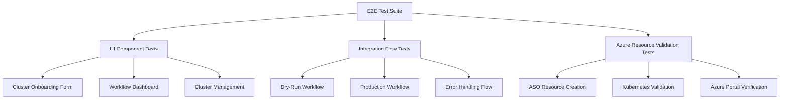
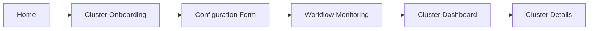
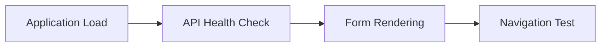
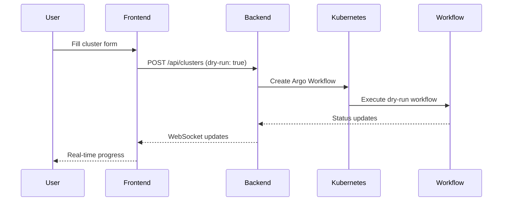
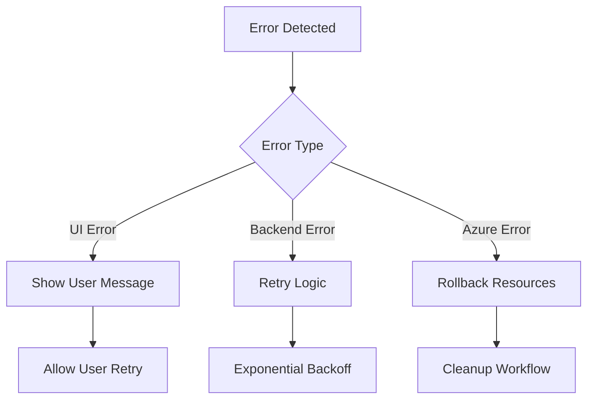
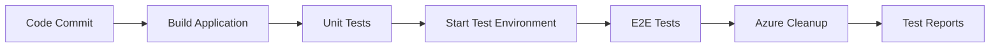

# End-to-End UI Testing Design for AKS Cluster Provisioning Platform

## Overview

This document outlines the design for comprehensive end-to-end (E2E) UI testing of the AKS Internal Developer Platform, ensuring that the complete user workflow from cluster configuration to Azure resource creation is thoroughly validated.

## Technology Stack & Dependencies

### Testing Framework
- **Primary Framework**: Cypress (React application E2E testing)
- **Test Runner**: Jest (unit and integration tests)
- **API Testing**: Cypress network stubbing + Real API validation
- **Azure Integration**: Azure CLI + Azure Resource Manager APIs
- **Kubernetes Validation**: kubectl commands + K8s JavaScript client

### Testing Environment
- **Local Development**: Minikube cluster with pre-installed CRDs
- **Azure Connectivity**: Real Azure subscription for resource validation
- **Network Configuration**: Local backend (port 3001) + frontend (port 3000)

## Component Architecture

### Test Suite Structure



### Component Definition

#### UI Component Tests
| Component | Test Focus | Validation Points |
|-----------|------------|------------------|
| ClusterOnboarding | Form validation, user interaction | Input validation, dropdown population, real-time feedback |
| WorkflowDashboard | Real-time updates, status tracking | WebSocket connections, progress indicators, log display |
| ClusterManagement | CRUD operations, data display | Data grid functionality, filtering, cluster lifecycle |

#### Integration Flow Tests
| Flow Type | Scope | Validation Criteria |
|-----------|-------|-------------------|
| Dry-Run | UI → Backend → K8s → Simulation | Workflow creation without Azure resources |
| Production | UI → Backend → K8s → Azure | Complete cluster provisioning in Azure |
| Error Handling | Failure scenarios, user feedback | Graceful degradation, error messages |

## Routing & Navigation

### Test Navigation Flow


### Navigation Test Cases
- **Deep Linking**: Direct navigation to specific cluster details
- **Back/Forward Navigation**: Browser history validation
- **Authentication Redirects**: User session management
- **Mobile Responsiveness**: Touch navigation and responsive design

## API Integration Layer

### Backend Service Validation

#### Cluster Service Tests
```javascript
// Example test structure for API validation
describe('Cluster Service Integration', () => {
  test('POST /api/clusters - Dry Run Creation', () => {
    // Validates cluster creation without Azure resources
  });
  
  test('GET /api/clusters/:id - Status Monitoring', () => {
    // Validates real-time cluster status updates
  });
});
```

#### Azure Service Integration
| Endpoint | Test Type | Validation |
|----------|-----------|------------|
| `/api/azure/locations` | Mock + Real | Location data accuracy |
| `/api/azure/node-pool-types` | Mock + Real | VM size recommendations |
| `/api/workflows/:id/status` | Real-time | WebSocket updates |

### Kubernetes Integration Testing
- **CRD Validation**: Verify ASO, KRO, and Argo Workflows CRDs are available
- **RBAC Testing**: Service account permissions validation
- **Resource Creation**: Monitor Kubernetes resource lifecycle

## Testing Strategy

### Test Categories

#### 1. Smoke Tests (5-10 minutes)
**Purpose**: Verify basic application functionality


**Test Cases**:
- Application loads without errors
- All major UI components render correctly
- Backend API health endpoint responds
- Basic navigation between pages works

#### 2. Feature Tests (15-30 minutes)
**Purpose**: Validate complete user workflows

**Dry-Run Workflow Test**:


**Production Workflow Test**:
- Complete cluster configuration form
- Submit production cluster creation
- Monitor Argo Workflow execution
- Validate ASO resource creation
- Verify Azure resource provisioning
- Confirm cluster accessibility

#### 3. Integration Tests (30-60 minutes)
**Purpose**: Validate end-to-end Azure integration

**Azure Resource Validation Flow**:
1. **Pre-test Setup**: Clean Azure resource group
2. **Cluster Creation**: Submit production cluster via UI
3. **Workflow Monitoring**: Track Argo Workflow progress
4. **Resource Validation**: Verify Azure resources using Azure CLI
5. **Cleanup**: Delete test resources

## Azure Resource Verification

### ASO Resource Validation
```yaml
# Template for validation checks
apiVersion: containerservice.azure.com/v1api20240402preview
kind: ManagedCluster
metadata:
  name: test-cluster-name
  namespace: azure-system
spec:
  # Validate cluster configuration matches UI input
  location: uksouth  # From cluster.yaml
  kubernetesVersion: "1.32"
  nodeProvisioningProfile:
    mode: Auto  # NAP enabled validation
```

### Azure CLI Integration
```bash
# Test script for Azure resource validation
az aks list --resource-group rg-test-cluster --output table
az aks show --name test-cluster --resource-group rg-test-cluster
az aks get-credentials --name test-cluster --resource-group rg-test-cluster
```

### Kubernetes Cluster Validation
```bash
# Validate cluster accessibility and configuration
kubectl cluster-info
kubectl get nodes
kubectl get pods --all-namespaces
```

## Test Data Management

### Test Configuration Matrix
| Scenario | Location | Node Pool Type | NAP Enabled | Dry Run | Expected Outcome |
|----------|----------|---------------|-------------|---------|------------------|
| Basic Dry Run | eastus | standard | true | true | Workflow success, no Azure resources |
| Production Standard | uksouth | standard | true | false | Complete cluster in Azure |
| Memory Optimized | westeurope | memory-optimized | true | false | High-memory node pool |
| Compute Optimized | northeurope | compute-optimized | false | true | CPU-intensive simulation |

### Test Data Sources
- **Static Configuration**: Predefined test cluster configurations
- **Dynamic Generation**: Random cluster names with timestamp
- **Environment Variables**: Azure subscription, resource group names
- **Configuration Files**: Test-specific cluster.yaml variations

## Error Handling & Recovery

### Error Scenario Testing

#### UI Error Handling
- **Form Validation**: Invalid inputs, missing required fields
- **Network Errors**: Backend unavailable, timeout scenarios  
- **Authentication**: Expired sessions, unauthorized access

#### Backend Error Scenarios
- **Kubernetes Connection**: Cluster unreachable, RBAC failures
- **Azure Service**: ASO operator issues, Azure API limits
- **Workflow Failures**: Argo Workflow execution errors

#### Recovery Mechanisms


## Performance & Load Testing

### Performance Criteria
- **Page Load Time**: < 3 seconds for initial load
- **Form Submission**: < 5 seconds for validation response
- **Real-time Updates**: WebSocket latency < 1 second
- **Workflow Completion**: Dry-run < 2 minutes, Production < 15 minutes

### Load Testing Scenarios
- **Concurrent Users**: 5-10 simultaneous cluster creations
- **Workflow Queue**: Multiple workflows in different states
- **Resource Scaling**: Large cluster configurations (100+ nodes)

## Continuous Integration Integration

### Test Execution Pipeline


### Environment Management
- **Test Isolation**: Unique resource groups per test run
- **Parallel Execution**: Independent test environments
- **Resource Cleanup**: Automated cleanup after test completion
- **Test Reporting**: Detailed logs, screenshots, video recordings

### CI/CD Integration Points
- **Pre-deployment**: Smoke tests on staging
- **Post-deployment**: Full E2E suite on production-like environment
- **Scheduled Tests**: Nightly full regression testing
- **Manual Triggers**: On-demand testing for specific scenarios

## Test Execution Commands

### Local Development
```bash
# Start test environment
npm run test:e2e:setup

# Run smoke tests
npm run test:e2e:smoke

# Run full E2E suite
npm run test:e2e:full

# Run specific test category
npm run test:e2e -- --grep "dry-run"

# Cleanup test resources
npm run test:e2e:cleanup
```

### CI/CD Pipeline
```bash
# Parallel test execution
npm run test:e2e:parallel --workers=3

# Azure resource validation
npm run test:azure:validate

# Generate test reports
npm run test:reports:generate
```

## Monitoring & Observability

### Test Metrics Collection
- **Test Execution Time**: Track performance trends
- **Failure Rates**: Identify flaky tests
- **Azure Resource Usage**: Monitor test infrastructure costs
- **Coverage Metrics**: Ensure comprehensive workflow coverage

### Alerting & Notifications
- **Test Failures**: Immediate notification for critical path failures  
- **Performance Degradation**: Alerts for increased execution times
- **Azure Resource Issues**: Monitoring for resource provisioning failures
- **Dashboard Integration**: Real-time test status visibility

## Security & Compliance Testing

### Security Validation
- **Authentication**: User session management
- **Authorization**: Role-based access control
- **Data Sanitization**: Input validation and XSS prevention
- **API Security**: Rate limiting and request validation

### Compliance Checks
- **Azure Resource Policies**: Validate policy compliance
- **Kubernetes Security**: RBAC and network policies
- **Data Handling**: PII protection and audit trails
- **Regulatory Requirements**: Industry-specific compliance validation