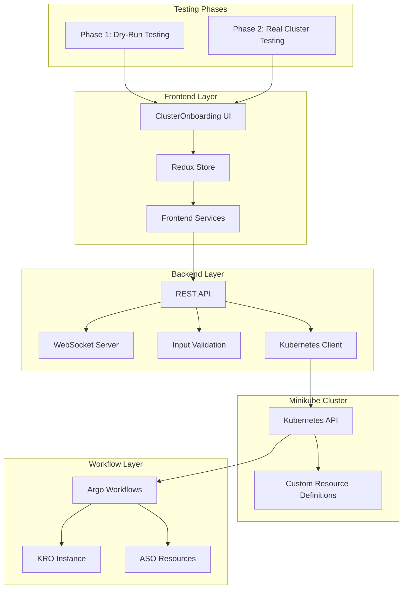
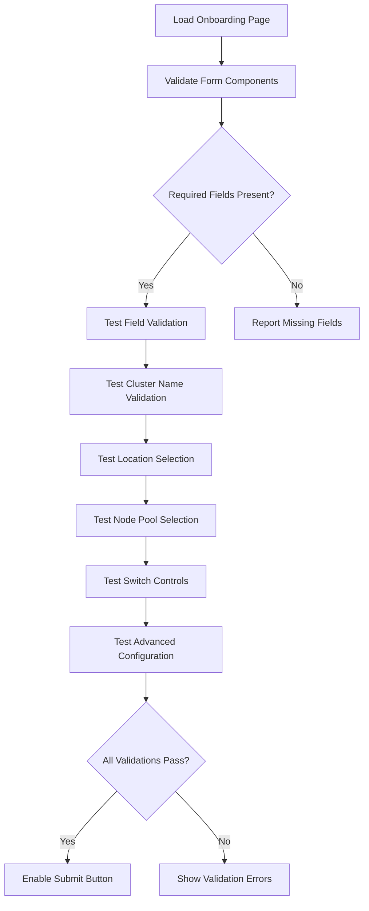
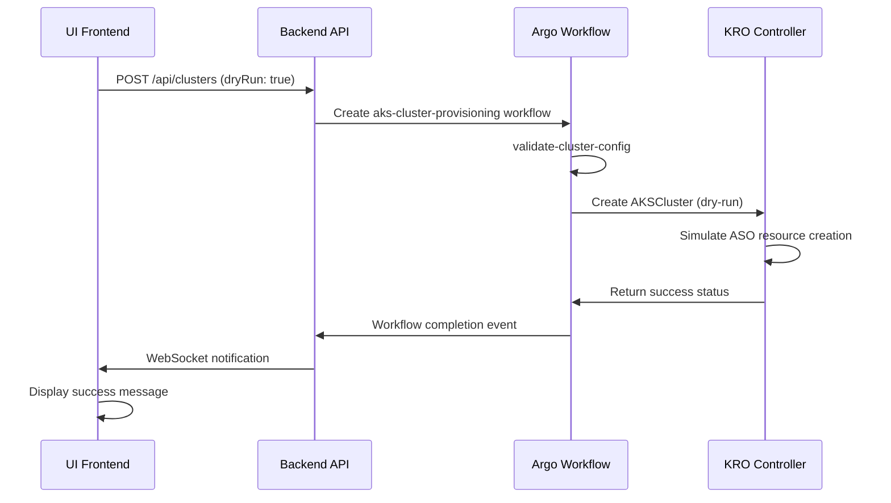
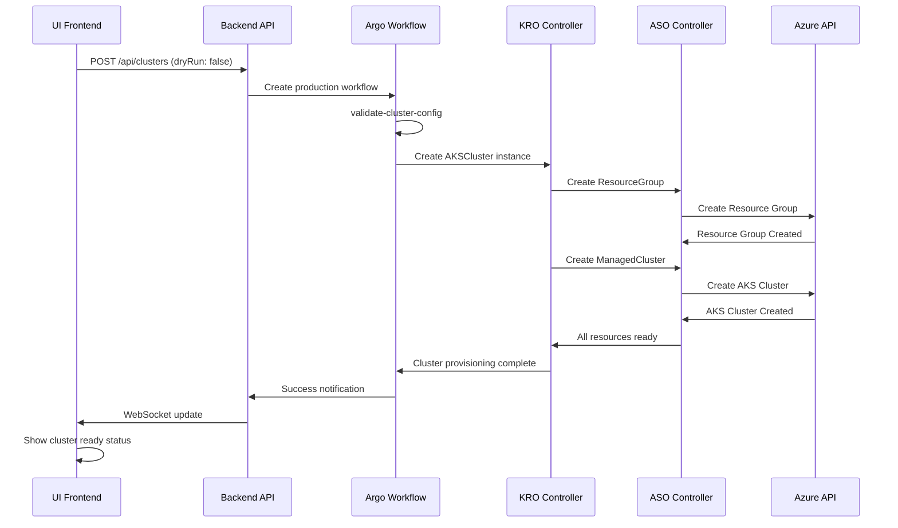
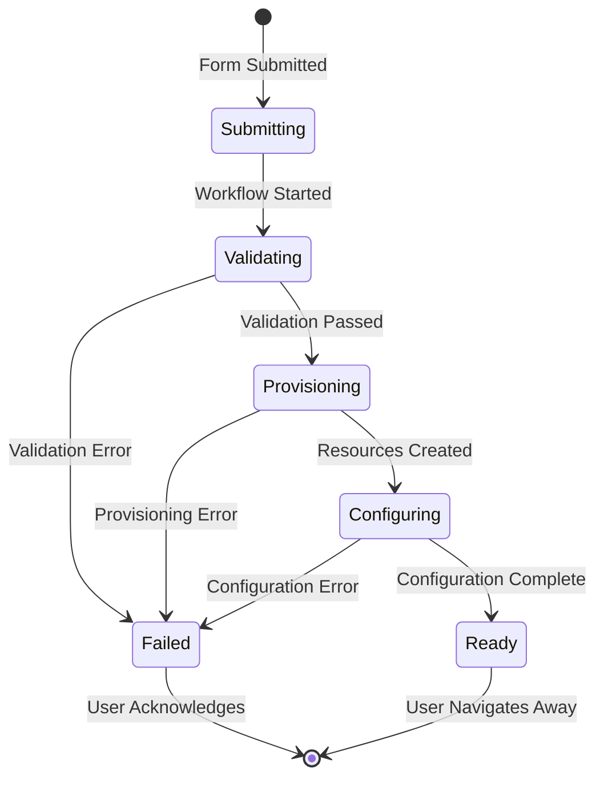

# Test UI Onboarding Process Design

## Overview

This design document outlines the comprehensive testing strategy for the AKS cluster onboarding UI process at `http://localhost:3000/onboarding`. The testing will verify both dry-run mode validation and real cluster provisioning workflows to ensure the UI properly integrates with backend services and Argo Workflows.

## Technology Stack

- **Frontend**: React with Material-UI, Redux Toolkit for state management
- **Backend**: Node.js with Express, WebSocket support for real-time updates
- **Workflows**: Argo Workflows with KRO (Kubernetes Resource Orchestrator) and ASO (Azure Service Operator)
- **Testing**: Manual UI testing with systematic validation of form inputs and workflow execution

## Local Development Environment

### Minikube Cluster Setup

The testing environment uses a local minikube cluster with all necessary tools pre-installed. The backend services connect to this minikube cluster to execute workflows and manage Kubernetes resources.

**Connection Configuration:**
- Backend uses local kubeconfig to connect to minikube
- Minikube cluster accessible at default kubectl context
- All CRDs and operators pre-deployed in the cluster

### CRD Verification

Before starting tests, verify all required Custom Resource Definitions are available:

```bash
# List all CRDs to verify installation
kubectl get crd

# Verify KRO CRDs
kubectl get crd | grep kro.run
kubectl explain aksclusters.kro.run

# Verify ASO CRDs  
kubectl get crd | grep azure.com
kubectl explain managedclusters.containerservice.azure.com
kubectl explain resourcegroups.resources.azure.com

# Verify Argo Workflows CRDs
kubectl get crd | grep argoproj.io
kubectl explain workflows.argoproj.io
kubectl explain workflowtemplates.argoproj.io
```

**Expected CRDs:**
- `aksclusters.kro.run` - KRO AKS cluster composition
- `managedclusters.containerservice.azure.com` - ASO managed clusters
- `resourcegroups.resources.azure.com` - ASO resource groups
- `workflows.argoproj.io` - Argo workflow instances
- `workflowtemplates.argoproj.io` - Argo workflow templates

## Testing Architecture



## Test Configuration Matrix

| Parameter | Dry-Run Values | Production Values |
|-----------|---------------|------------------|
| **Cluster Name** | test-cluster-dry, demo-cluster | prod-cluster-001 |
| **Location** | eastus, westus2 | eastus |
| **Node Pool Type** | standard, memory-optimized | standard |
| **Enable NAP** | true, false | true |
| **Kubernetes Version** | 1.28.3, 1.29.0 | 1.28.3 |
| **Max Nodes** | 5, 10 | 10 |
| **Enable Spot** | true, false | false |

## UI Component Validation

### Form Field Testing



### Expected UI Elements

| Element | Expected Behavior | Validation Rules |
|---------|------------------|------------------|
| **Cluster Name Field** | Alphanumeric input, 3-30 chars | Must match `^[a-zA-Z0-9-]*$` |
| **Location Dropdown** | Shows recommended regions first | eastus, westus2, uksouth, westeurope, centralus |
| **Node Pool Type** | Three options with descriptions | standard, memory-optimized, compute-optimized |
| **Dry Run Switch** | Defaults to ON (true) | Orange warning color when enabled |
| **Enable NAP Switch** | Defaults to ON (true) | Blue primary color |
| **Advanced Config** | Collapsible accordion | Shows when expanded |
| **Preview Button** | Shows JSON configuration | Enabled when form is valid |
| **Submit Button** | Dynamic text based on dry-run | "Validate Configuration" vs "Create Cluster" |

## Test Phase 1: Dry-Run Mode Validation

### Test Cases

#### TC1: Basic Form Validation
```
GIVEN: User navigates to http://localhost:3000/onboarding
WHEN: User fills form with valid inputs and dry-run enabled
THEN: Form should validate successfully and enable submission
```

#### TC2: Dry-Run Workflow Execution
```
GIVEN: Valid form with dry-run mode enabled
WHEN: User clicks "Validate Configuration"
THEN: 
  - Backend should receive request with dryRun: true
  - Argo Workflow should start with dry-run parameters
  - UI should show workflow progress
  - No actual Azure resources should be created
```

#### TC3: WebSocket Communication
```
GIVEN: Dry-run workflow is executing
WHEN: Workflow steps complete
THEN: 
  - UI should receive real-time updates via WebSocket
  - Progress indicators should update accordingly
  - Workflow logs should display in UI
```

### Expected Dry-Run Workflow Steps



### Dry-Run Validation Points

1. **Input Validation**: All form fields validated according to schema
2. **Configuration Preview**: JSON preview shows correct structure
3. **Workflow Creation**: Argo Workflow created with dry-run flag
4. **Resource Simulation**: KRO simulates Azure resource creation
5. **Status Updates**: Real-time workflow status via WebSocket
6. **No Side Effects**: No actual Azure resources created

## Test Phase 2: Real Cluster Provisioning

### Prerequisites

- Local minikube cluster running with all tools pre-installed:
  - KRO (Kubernetes Resource Orchestrator)
  - ASO (Azure Service Operator) 
  - Argo Workflows with proper RBAC
- kubectl configured to connect to minikube cluster
- All required CRDs available for inspection
- Azure subscription with proper permissions (for production testing)
- Service Principal configured for ASO (for production testing)

### Test Cases

#### TC4: Production Workflow Execution
```
GIVEN: Valid form with dry-run mode disabled
WHEN: User clicks "Create Cluster"
THEN: 
  - Backend should receive request with dryRun: false
  - Real Argo Workflow should execute
  - Actual Azure resources should be created
  - UI should track real provisioning progress
```

#### TC5: Resource Creation Verification
```
GIVEN: Production workflow has completed successfully
WHEN: Workflow finishes
THEN: 
  - Azure ResourceGroup should exist
  - AKS cluster should be provisioned
  - Node pools should be configured correctly
  - All ASO resources should be in Ready state
```

### Real Workflow Steps



## Error Handling Testing

### Frontend Error Scenarios

| Error Type | Trigger | Expected UI Behavior |
|------------|---------|----------------------|
| **Validation Error** | Invalid cluster name | Red error text below field |
| **Network Error** | Backend unavailable | Toast notification with retry option |
| **Workflow Error** | Workflow execution failure | Error alert with workflow logs |
| **WebSocket Error** | Connection lost | Reconnection attempt with indicator |

### Backend Error Scenarios

| Error Type | Response Code | UI Handling |
|------------|--------------|-------------|
| **Bad Request** | 400 | Show validation errors |
| **Unauthorized** | 401 | Redirect to login |
| **Internal Error** | 500 | Generic error message |
| **Service Unavailable** | 503 | Retry mechanism |

## Real-Time Monitoring

### WebSocket Message Types

```typescript
interface WorkflowStatusMessage {
  type: 'workflow_status'
  workflowId: string
  status: 'running' | 'succeeded' | 'failed'
  phase: string
  message: string
}

interface WorkflowLogMessage {
  type: 'workflow_log'
  workflowId: string
  timestamp: string
  level: 'info' | 'warning' | 'error'
  message: string
}
```

### UI Status Updates



## Testing Checklist

### Pre-Test Setup
- [ ] Minikube cluster running and accessible via kubectl
- [ ] Verify all required CRDs are installed (see CRD Verification below)
- [ ] Frontend application running on http://localhost:3000
- [ ] Backend API running on http://localhost:3001
- [ ] Backend configured to connect to minikube cluster
- [ ] Argo Workflows accessible and configured
- [ ] KRO and ASO operators installed in minikube
- [ ] Azure credentials configured (for production mode)
- [ ] WebSocket connection functional

### Dry-Run Testing
- [ ] Verify minikube connection working (`kubectl cluster-info`)
- [ ] Verify all required CRDs are available
- [ ] Form loads correctly with all expected fields
- [ ] Validation messages appear for invalid inputs
- [ ] Dry-run switch is enabled by default
- [ ] Configuration preview displays correct JSON
- [ ] Submit button shows "Validate Configuration"
- [ ] Workflow starts successfully with dry-run flag
- [ ] WebSocket updates received in real-time
- [ ] No Azure resources created (dry-run simulation only)
- [ ] Success message displayed on completion

### Production Testing
- [ ] Dry-run switch can be disabled
- [ ] Submit button changes to "Create Cluster"
- [ ] Warning message shown for production mode
- [ ] Real workflow executes successfully
- [ ] Azure resources created as expected
- [ ] Cluster becomes accessible
- [ ] GitOps configuration applied
- [ ] Monitoring and logging enabled

### Error Handling
- [ ] Network failures handled gracefully
- [ ] Invalid inputs show appropriate errors
- [ ] Workflow failures display error messages
- [ ] WebSocket reconnection works
- [ ] User can retry failed operations

## Performance Criteria

| Metric | Target | Measurement |
|--------|--------|-------------|
| **Page Load Time** | < 2 seconds | Browser DevTools |
| **Form Validation** | < 500ms | User interaction timing |
| **WebSocket Latency** | < 1 second | Message round-trip time |
| **Dry-Run Workflow** | < 30 seconds | Workflow completion time |
| **Production Workflow** | < 10 minutes | Full cluster provisioning |

## Security Considerations

### Input Validation
- Cluster names sanitized to prevent injection
- Location values restricted to allowed regions
- Advanced configuration parameters validated
- File uploads (if any) scanned for malicious content

### Authentication & Authorization
- User authentication required for cluster creation
- RBAC permissions validated for Azure operations
- Service account permissions minimal and scoped
- Audit logging for all cluster operations

## Cleanup Procedures

### Post-Test Cleanup
1. **Delete Test Resources from Minikube**: Remove any test resources created in minikube
2. **Clean Workflow Instances**: Clear completed workflow instances from Argo
3. **Reset Browser State**: Reset Redux store and localStorage
4. **Verify Minikube State**: Ensure minikube cluster is clean for next test
5. **Check Azure Resources**: For production tests, verify all Azure resources removed

### Automated Cleanup Script
```bash
#!/bin/bash
# Cleanup test resources from minikube
kubectl delete aksclusters.kro.run --all --timeout=60s
kubectl delete workflows --all --timeout=60s

# For production tests - cleanup Azure resources
az group list --query "[?starts_with(name, 'rg-test-')].name" -o tsv | xargs -I {} az group delete --name {} --yes --no-wait

# Verify minikube cluster status
kubectl get all --all-namespaces
echo "Minikube cluster ready for next test"
```

### CRD Debugging Commands

If tests fail, use these commands to inspect CRD status and troubleshoot:

```bash
# Check specific CRD details
kubectl explain aksclusters.kro.run.spec
kubectl explain managedclusters.containerservice.azure.com.spec

# View CRD instances
kubectl get aksclusters.kro.run -o yaml
kubectl get workflows.argoproj.io -o yaml

# Check operator status
kubectl get pods -n kro-system
kubectl get pods -n azureserviceoperator-system
kubectl get pods -n argo

# View operator logs
kubectl logs -n kro-system -l app=kro-controller
kubectl logs -n azureserviceoperator-system -l app=azureserviceoperator-controller-manager
kubectl logs -n argo -l app=workflow-controller
```