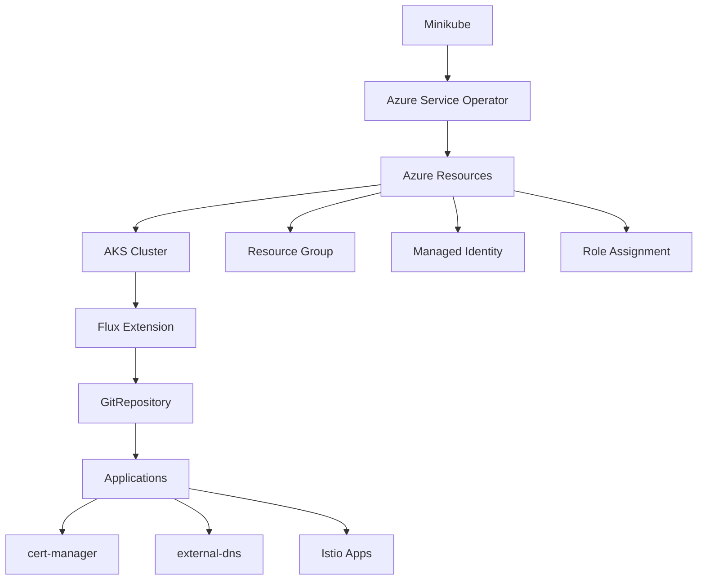

# ASO-Stack: AKS Cluster Deployment with GitOps

This directory contains the Azure Service Operator (ASO) manifests and FluxCD configuration for deploying an AKS cluster from a Minikube control plane, then using GitOps to deploy applications onto the AKS cluster.

## Architecture Overview



## Directory Structure

```
aso-stack/
├── README.md                    # This file
├── kustomization.yaml          # Kustomize manifest ordering
├── resourcegroup.yaml          # Azure Resource Group
├── identity.yaml               # User Assigned Managed Identity
├── roleassignment.yaml         # RBAC for managed identity
├── cluster.yaml                # AKS Cluster configuration
├── federated.yaml              # Federated identity credential
├── extension.yaml              # Flux extension for AKS
├── fluxconfiguration.yaml      # GitOps configuration
└── flux-setup-instructions.md  # Additional setup notes
```

## Deployment Flow

### Phase 1: Infrastructure Provisioning (Minikube → Azure)

1. **Minikube Control Plane Setup**
   - Azure Service Operator runs on Minikube
   - ASO manages Azure resources via Azure ARM APIs
   - All infrastructure defined as Kubernetes manifests

2. **Azure Resource Creation Order**

   ```yaml
   # Applied in sequence via kustomization.yaml:
   - resourcegroup.yaml # Creates Azure Resource Group
   - identity.yaml # Creates User Assigned Managed Identity
   - roleassignment.yaml # Grants permissions to identity
   - cluster.yaml # Provisions AKS cluster with Istio
   - federated.yaml # Links AKS identity to workload identity
   - extension.yaml # Installs Flux extension on AKS
   - fluxconfiguration.yaml # Configures GitOps source and sync
   ```

3. **Key Infrastructure Features**
   - **Private AKS cluster** with public FQDN for management
   - **Istio service mesh** (asm-1-25 revision) with internal ingress
   - **Cilium networking** (overlay mode with network policy)
   - **Workload Identity** enabled for pod-to-Azure authentication
   - **Auto-scaling** with Node Auto Provisioning (NAP)
   - **Azure monitoring** and security features enabled

### Phase 2: GitOps Application Deployment (AKS → Applications)

1. **Flux Configuration**
   - Flux extension automatically installed on AKS cluster
   - GitRepository source: `https://github.com/davidmarkgardiner/claude-aso`
   - Branch: `infra`
   - Sync interval: 120 seconds

2. **Application Kustomizations**

   ```yaml
   # Two parallel sync paths:
   app: # Path: ./apps
     - cert-manager # TLS certificate management
     - external-dns # DNS record automation

   istio-app: # Path: ./istio-apps
     - namespaces # Application namespaces
     - gateways # Istio ingress configuration
     - podinfo # Demo applications
     - traffic policies # Istio CRDs and routing
   ```

3. **Continuous Deployment**
   - Changes to `infra` branch trigger automatic sync
   - Prune enabled: removes resources not in Git
   - Force sync: overwrites manual cluster changes
   - Timeout: 600 seconds per sync operation

## Key Configuration Details

### AKS Cluster Specifications

- **Location**: UK South
- **Kubernetes Version**: 1.32
- **Node Pool**: System pool with Standard_D4s_v3 (1 node, availability zone 1)
- **Network**: Azure CNI Overlay with Cilium dataplane
- **Service Mesh**: Istio with internal ingress gateway
- **Identity**: Azure RBAC with AAD integration
- **Security**: Private cluster, workload identity, defender enabled

### GitOps Configuration

- **Repository**: https://github.com/davidmarkgardiner/claude-aso
- **Branch**: infra
- **Applications Path**: `./apps` and `./istio-apps`
- **Sync Mode**: Automatic every 2 minutes
- **Reconciliation**: Force sync with pruning enabled

## Prerequisites

1. **Minikube** with sufficient resources (4GB+ RAM recommended)
2. **Azure Service Operator** installed on Minikube
3. **Azure subscription** with appropriate permissions
4. **GitHub repository** with application manifests
5. **kubectl** configured for both Minikube and AKS contexts

## Deployment Steps

1. **Apply ASO manifests to Minikube**

   ```bash
   kubectl apply -k /path/to/aso-stack
   ```

2. **Monitor Azure resource creation**

   ```bash
   # Check ASO resource status
   kubectl get resourcegroup,managedidentity,managedcluster -n azure-system

   # Monitor cluster provisioning (15-20 minutes)
   kubectl describe managedcluster uk8s-tsshared-weu-gt025-int-prod -n azure-system
   ```

3. **Obtain AKS credentials**

   ```bash
   az aks get-credentials --resource-group at39473-weu-dev-prod --name uk8s-tsshared-weu-gt025-int-prod
   ```

4. **Verify Flux deployment**

   ```bash
   # Check Flux extension
   kubectl get extension -n azure-system

   # Check GitOps sync status
   kubectl get gitrepository,kustomization -n flux-system
   ```

5. **Verify application deployment**

   ```bash
   # Check cert-manager
   kubectl get pods -n cert-manager

   # Check external-dns
   kubectl get pods -n external-dns

   # Check Istio applications
   kubectl get pods -n istio-system
   kubectl get gateway,virtualservice -A
   ```

## Monitoring and Troubleshooting

### Infrastructure Status

```bash
# ASO operator status
kubectl get pods -n azureserviceoperator-system

# Azure resource provisioning status
kubectl get managedcluster uk8s-tsshared-weu-gt025-int-prod -n azure-system -o yaml
```

### GitOps Status

```bash
# Flux controllers
kubectl get pods -n flux-system

# Sync status and errors
kubectl describe gitrepository -n flux-system
kubectl describe kustomization -n flux-system

# Flux logs
kubectl logs -n flux-system -l app=source-controller
kubectl logs -n flux-system -l app=kustomize-controller
```

### Application Health

```bash
# All applications
kubectl get helmrelease -A
kubectl get pods -A | grep -E "(cert-manager|external-dns|istio)"

# Istio gateway status
kubectl get gateway -n istio-system
kubectl get vs,dr -A
```

## Security Considerations

- **Private cluster**: API server only accessible via private network
- **Workload Identity**: Pods authenticate to Azure using managed identities
- **RBAC**: Fine-grained permissions with Azure RBAC integration
- **Network policies**: Cilium enforces pod-to-pod communication rules
- **Image scanning**: Container image vulnerability scanning enabled
- **Secret management**: Azure Key Vault integration for sensitive data

## Cost Optimization

- **Node Auto Provisioning**: Automatically scales nodes based on workload requirements
- **Spot instances**: Can be configured for non-production workloads
- **Resource quotas**: Prevent resource overconsumption
- **Monitoring**: Azure Monitor tracks resource utilization and costs

## Next Steps

1. Configure DNS zones for external-dns automation
2. Set up TLS certificates for ingress traffic
3. Deploy monitoring stack (Prometheus/Grafana)
4. Implement backup strategies for persistent workloads
5. Configure alerting and incident response procedures
