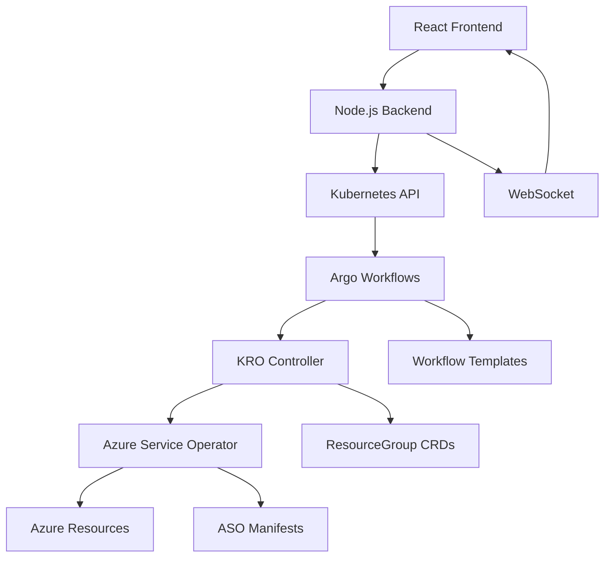

# AKS Internal Developer Platform (IDP)

A comprehensive Internal Developer Platform similar to Backstage for onboarding Azure Kubernetes Service (AKS) clusters using modern cloud-native orchestration tools.

## 🏗️ Architecture Overview

This IDP integrates several cutting-edge technologies to provide a seamless self-service experience for AKS cluster provisioning:

- **Frontend**: React-based UI similar to Backstage
- **Backend**: Node.js/Express API server with WebSocket support
- **Orchestration**: Argo Workflows for cluster provisioning workflows
- **Resource Composition**: KRO (Kubernetes Resource Orchestrator) for defining composite cluster resources
- **Azure Integration**: Azure Service Operator (ASO) for managing Azure resources
- **Node Management**: Node Auto Provisioning (NAP) for dynamic node scaling

## 🚀 Features

### ✨ Self-Service Cluster Onboarding
- **Location Selection**: Choose from multiple Azure regions with recommendations
- **Node Pool Configuration**: Select from standard, memory-optimized, or compute-optimized pools
- **NAP Integration**: Automatic node provisioning based on workload demands
- **Dry-Run Capability**: Test configurations without creating actual Azure resources

### 📊 Real-Time Monitoring
- **Workflow Dashboard**: Monitor cluster provisioning progress in real-time
- **Live Logs**: View detailed logs from Argo Workflows
- **Resource Status**: Track Azure resource creation status
- **WebSocket Updates**: Real-time notifications and status updates

### 🎛️ Cluster Management
- **Cluster Overview**: View all provisioned clusters in a centralized dashboard
- **Lifecycle Operations**: Manage cluster lifecycle (create, update, delete)
- **Status Monitoring**: Real-time cluster health and status monitoring

## 📋 Prerequisites

Before setting up the IDP, ensure you have the following prerequisites installed:

### Required Tools
- **kubectl** (v1.27+): Kubernetes command-line tool
- **minikube** or access to a Kubernetes cluster
- **Node.js** (v18+): For running the backend and frontend
- **npm** or **yarn**: Package manager
- **jq**: Command-line JSON processor
- **Azure CLI** (optional): For Azure resource management

### Kubernetes Requirements
- **Azure Service Operator (ASO)**: Must be pre-installed
- **Argo Workflows**: Will be installed by the setup script
- **KRO**: Will be installed by the setup script

## 🛠️ Quick Start

### 1. Clone and Setup

```bash
# Navigate to your workspace
cd /path/to/your/workspace

# Setup the project structure (if not already done)
git clone <your-repo-url>
cd qoder-backstage/idp-platform

# Install dependencies
cd backend && npm install
cd ../frontend && npm install
```

### 2. Prerequisites Installation

Run the automated setup script that installs all required components:

```bash
# Make the script executable
chmod +x scripts/setup-prerequisites.sh

# Run with dry-run to see what will be installed
./scripts/setup-prerequisites.sh --dry-run --verbose

# Run the actual installation
./scripts/setup-prerequisites.sh --verbose
```

### 3. Start the Platform

```bash
# Start the backend server (in one terminal)
cd backend
npm start
# Backend will run on http://localhost:3001

# Start the frontend (in another terminal)
cd frontend
npm start
# Frontend will run on http://localhost:3000
```

### 4. Access the Platform

Open your browser and navigate to:
- **Frontend UI**: http://localhost:3000
- **Backend API**: http://localhost:3001
- **Health Check**: http://localhost:3001/health

## 📖 Usage Guide

### Creating a New AKS Cluster

1. **Navigate to Cluster Onboarding**
   - Open the IDP frontend at http://localhost:3000
   - Click on the "Cluster Onboarding" tab

2. **Configure Your Cluster**
   - **Cluster Name**: Enter a unique name (3-30 characters, alphanumeric)
   - **Azure Region**: Select from recommended or all available regions
   - **Node Pool Type**: Choose based on your workload requirements:
     - **Standard**: Balanced CPU/memory for general workloads
     - **Memory Optimized**: High memory-to-CPU ratio for memory-intensive tasks
     - **Compute Optimized**: High CPU-to-memory ratio for compute-intensive tasks

3. **Advanced Configuration** (Optional)
   - **Kubernetes Version**: Specify version or use default
   - **Max Nodes**: Set maximum number of nodes for auto-scaling
   - **Enable Spot Instances**: For cost optimization

4. **Enable Features**
   - **Dry Run Mode**: Test configuration without creating Azure resources
   - **Node Auto Provisioning (NAP)**: Enable automatic node scaling

5. **Submit and Monitor**
   - Click "Create Cluster" or "Validate Configuration" (dry-run)
   - Monitor progress in the "Workflow Dashboard"

### Monitoring Workflows

1. **View Active Workflows**
   - Navigate to the "Workflow Dashboard"
   - See real-time status of ongoing cluster provisioning

2. **View Workflow Details**
   - Click on any workflow to see detailed steps and logs
   - Monitor progress through validation, resource creation, and finalization

3. **Manage Workflows**
   - **Abort**: Stop a running workflow if needed
   - **Retry**: Restart a failed workflow
   - **View Logs**: See detailed execution logs

### Managing Clusters

1. **View All Clusters**
   - Navigate to "Cluster Management"
   - See a comprehensive list of all provisioned clusters

2. **Cluster Details**
   - Click on any cluster to view detailed information
   - See cluster configuration, status, and resource information

3. **Cluster Operations**
   - **Delete**: Remove a cluster (with dry-run option)
   - **Refresh**: Update cluster status

## 🔧 Configuration

### Environment Variables

The platform can be configured using environment variables:

#### Backend Configuration
```bash
PORT=3001                    # Backend server port
NODE_ENV=development         # Environment mode
```

#### Kubernetes Configuration
```bash
KUBE_CONTEXT=minikube       # Kubernetes context to use
NAMESPACE_DEFAULT=default    # Default namespace
NAMESPACE_AZURE=azure-system # Azure Service Operator namespace
NAMESPACE_ARGO=argo         # Argo Workflows namespace
```

### Azure Configuration

Update the Azure configuration in `k8s-manifests/aso-resources/config.yaml`:

```yaml
data:
  config.yaml: |
    azure:
      defaultRegion: "eastus"
      defaultKubernetesVersion: "1.28.3"
      enableMonitoring: true
      enablePolicy: true
```

## 🏗️ Architecture Details

### Component Interaction Flow



### Data Flow

1. **User Input**: User configures cluster via React frontend
2. **API Processing**: Backend validates and processes the request
3. **Workflow Creation**: Argo Workflow is created with user parameters
4. **Resource Composition**: KRO generates Azure resource definitions
5. **Azure Provisioning**: ASO creates actual Azure resources
6. **Status Updates**: Real-time updates via WebSocket to frontend

### Security Model

- **RBAC**: Kubernetes Role-Based Access Control for service accounts
- **Namespace Isolation**: Resources are isolated in appropriate namespaces
- **Dry-Run Support**: Safe testing without creating actual resources
- **Service Account Permissions**: Minimal required permissions for each component

## 🧪 Testing

### Dry-Run Testing

Test the platform without creating actual Azure resources:

```bash
# Submit a test workflow via kubectl
kubectl create -f test-workflow.yaml

# Monitor the workflow
kubectl get workflows -w

# Check workflow logs
kubectl logs <workflow-pod-name> -c main
```

### Manual Testing

1. **API Testing**
   ```bash
   # Health check
   curl http://localhost:3001/health
   
   # Get Azure locations
   curl http://localhost:3001/api/azure/locations
   
   # Get node pool types
   curl http://localhost:3001/api/azure/node-pool-types
   ```

2. **Workflow Testing**
   ```bash
   # List workflow templates
   kubectl get workflowtemplates
   
   # Submit test workflow
   argo submit --from workflowtemplate/aks-cluster-provisioning-simple \
     --parameter cluster-name=test-cluster \
     --parameter dry-run=true
   ```

## 🐛 Troubleshooting

### Common Issues

#### 1. RBAC Permissions
**Error**: `workflowtaskresults.argoproj.io is forbidden`
**Solution**: Apply the RBAC fix:
```bash
kubectl apply -f k8s-manifests/argo-workflows/rbac-fix.yaml
```

#### 2. Image Pull Issues
**Error**: Pods stuck in `PodInitializing`
**Solution**: Check image availability or use different images:
```bash
kubectl describe pod <pod-name>
```

#### 3. Backend Connection Issues
**Error**: Frontend can't connect to backend
**Solution**: Verify backend is running and ports are correct:
```bash
# Check backend status
curl http://localhost:3001/health

# Check if port is in use
lsof -i :3001
```

#### 4. Workflow Failures
**Error**: Workflows fail to execute
**Solution**: Check workflow logs and RBAC:
```bash
kubectl describe workflow <workflow-name>
kubectl logs <workflow-pod> -c main
```

### Useful Commands

```bash
# Check all components status
kubectl get pods -A | grep -E "(argo|azure|kro)"

# Monitor workflows
kubectl get workflows -w

# Check ASO resources
kubectl get managedclusters.containerservice.azure.com -A

# View workflow templates
kubectl get workflowtemplates

# Check logs
kubectl logs -l app=argo-server -n argo
```

## 📚 API Reference

### Cluster Management API

#### `GET /api/clusters`
Get all clusters
```json
{
  "clusters": [...],
  "total": 5
}
```

#### `POST /api/clusters`
Create a new cluster
```json
{
  "name": "my-cluster",
  "location": "eastus",
  "nodePoolType": "standard",
  "dryRun": true,
  "enableNAP": true
}
```

#### `GET /api/clusters/:id`
Get specific cluster details
```json
{
  "cluster": {...},
  "workflow": {...},
  "resources": [...]
}
```

### Azure API

#### `GET /api/azure/locations`
Get available Azure locations
```json
{
  "locations": [
    {
      "name": "eastus",
      "displayName": "East US",
      "recommended": true
    }
  ]
}
```

#### `GET /api/azure/node-pool-types`
Get node pool types and recommendations
```json
{
  "nodePoolTypes": [...],
  "recommendations": [...]
}
```

### Workflow API

#### `GET /api/workflows`
Get workflows with optional filters
```json
{
  "workflows": [...],
  "total": 10
}
```

#### `GET /api/workflows/:id`
Get specific workflow details
```json
{
  "workflow": {...},
  "steps": [...],
  "logs": [...]
}
```

## 🤝 Contributing

1. Fork the repository
2. Create a feature branch (`git checkout -b feature/amazing-feature`)
3. Commit your changes (`git commit -m 'Add amazing feature'`)
4. Push to the branch (`git push origin feature/amazing-feature`)
5. Open a Pull Request

### Development Guidelines

- Follow the existing code style and patterns
- Add tests for new features
- Update documentation for any changes
- Ensure all workflows pass in dry-run mode

## 📄 License

This project is licensed under the MIT License - see the [LICENSE](LICENSE) file for details.

## 🙏 Acknowledgments

- [Backstage](https://backstage.io/) for the IDP inspiration
- [Argo Workflows](https://argoproj.github.io/workflows/) for workflow orchestration
- [Azure Service Operator](https://azure.github.io/azure-service-operator/) for Azure integration
- [KRO](https://kro.run/) for resource composition
- The Kubernetes community for the amazing ecosystem

## 📞 Support

For support and questions:
- Create an issue in the repository
- Check the troubleshooting section
- Review the workflow logs for detailed error information

---

**Happy Cluster Provisioning! 🚀**